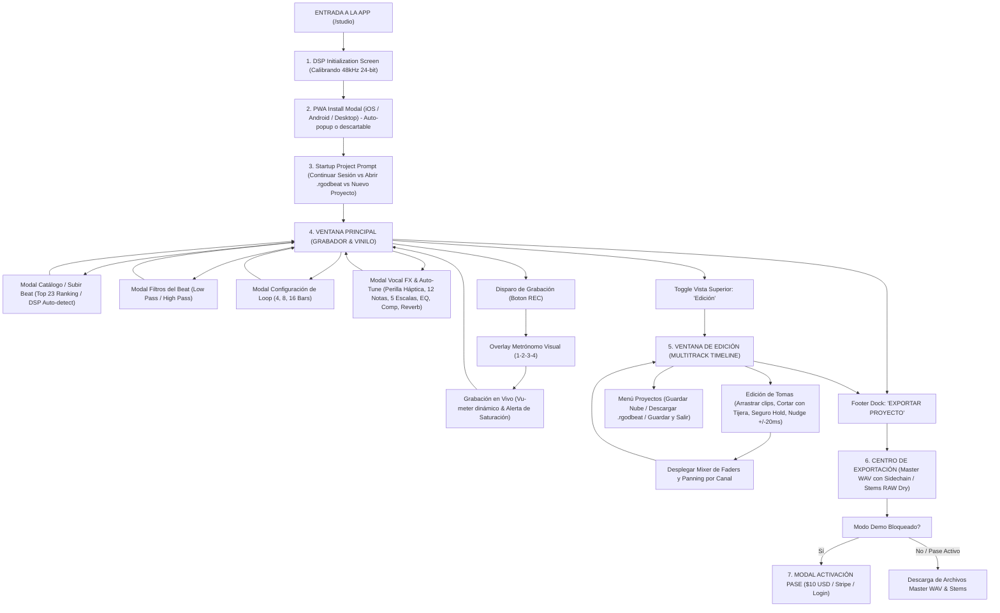

# RGODBEAT STUDIO // MAPA VISUAL COMPLETO & ROUTE MAP CINEMATOGRÁFICO
> **Documento Maestro de Pre-Producción para Campañas de Video Promocional con IA**  
> **Estado:** Documentación 100% verificada en el código fuente actual (`/app/studio/`, `/components/studio/`, `/lib/studio/`).  
> **Integridad:** Sin alteraciones de código, sin features inventadas, sin modificaciones de UI.

---

## 1. APP OVERVIEW

### Nombre
**RGODBEAT Studio**

### Qué es la aplicación
RGODBEAT Studio es una estación de trabajo de audio digital (DAW / Digital Audio Workstation) y grabador vocal profesional basada en la web (Web Audio API & DSP de baja latencia a 48.0 kHz / 24-bit). Funciona tanto en navegadores de escritorio (Chrome, Edge, Safari) como en dispositivos móviles (PWA instalable en iOS y Android).

### Para quién está diseñada
Está diseñada para artistas independientes, cantantes urbanos (Trap, Reggaetón, Drill, R&B, Pop, Hip-Hop), raperos y creadores de contenido musical que necesitan grabar sus voces sobre pistas musicales (beats) con calidad de estudio profesional directamente desde su teléfono o computadora, sin requerir software pesado ni conocimientos complejos de ingeniería en audio.

### Cuál es su propósito principal
Permitir que un artista elija un beat profesional, ensaye y grabe tomas vocales multipista (Leads, Dobles, Armonías y Adlibs) con afinación en tiempo real (Auto-Tune integrado y calibrado a la escala del beat), ecualización, compresión, saturación de cinta, delays sincronizados y reverbs convolutivas, ajustando micro-latencias y exportando el master final en WAV 24-bit con sidechain o stems vocales RAW separados para mezcla profesional.

### Qué problema resuelve
1. **La barrera de entrada técnica de los DAWs tradicionales:** Los programas de grabación tradicionales (Pro Tools, Logic, FL Studio, Ableton) son costosos, difíciles de configurar para un cantante y requieren interfaces de audio externas.
2. **Desincronización vocal por latencia Bluetooth:** Elimina el desfase que sufren los usuarios al cantar usando auriculares inalámbricos (AirPods, Galaxy Buds) mediante un motor de compensación automática de retardo configurable (-185ms / -25ms).
3. **Desafinado en la escala equivocada:** Elimina la confusión del Auto-Tune tradicional analizando matemáticamente el beat en segundo plano para sincronizar la nota fundamental y escala automáticamente.
4. **Pérdida de proyectos:** Permite guardar la sesión en memoria local IndexDB (hasta 23 slots de beats), guardar en la nube en la cuenta del usuario, o descargar/cargar un archivo de sesión portátil `.rgodbeat`.

### Qué hace actualmente (Verificado en Código)
- **Motor DSP Web Audio API a 48.0 kHz 24-bit** con Screen Wake Lock para impedir que la pantalla del móvil se apague durante las sesiones.
- **Reproductor de Vinilo Animado (Plato Negro Carbón / Flow iPod)** con rotación realista vinculada al estado de reproducción.
- **Afinador Vocal en Tiempo Real (Auto-Tune / Pitch Correction)** controlado por una perilla rotatoria háptica (`TuneKnob`) con clic mecánico de detent en 0 (Bypass/Apagado) y soporte para 12 notas fundamentales y 5 modos de escala musical (Menor Natural, Mayor, Menor Armónica, Pentatónica, Cromática), indicando notas activas y tono relativo.
- **Canal de Efectos Vocales por Pista (Vocal FX Strip):** Low-cut filter de 80Hz, EQ de 3 bandas (Low, Mid, High en +/-12 dB), Compresor dinámico (0-100%), Saturación armónica de cinta (0-100%), Delay sincronizado al tempo (OFF, 1/8, 1/4, 1/2, 1 BAR), Reverb por convolución acústica con presets Room, Plate y Hall, y Panorámico Estéreo (L 100% - C - R 100%).
- **Filtro del Beat (Beat FX):** Low-pass filter (200Hz - 20kHz, efecto discoteca bajo el agua / muffled), High-pass filter (20Hz - 2kHz para limpiar sub-graves y frecuencias de 808) y volumen master independiente.
- **Grabación Multipista (Hasta 6-8 canales):** Lead 1, Lead 2, Double, Harmony 1, Harmony 2, Adlibs, con capacidad de añadir hasta 2 pistas adicionales de coros extra (+ Coro Extra).
- **Entorno de Edición Multitrack (`TimelineWorkspace`):** Regla de tiempo con compases musicales (Bars) y segundos, formas de onda (waveforms) continuas interpoladas de alta definición, cabezal de reproducción deslizante dorado con grab handle y badge flotante en tiempo real, herramienta de corte de tomas (Scissors), seguro contra desplazamientos accidentales (Lock / Hold), ajuste fino de posición (Nudge: +/-20ms, +/-100ms, +/-1 Bar), duplicación de toma entre pistas, borrado selectivo de clips y ajuste de zoom de 60% a 250%.
- **Sistema de Loop por Compases:** Reproducción cíclica para ensayos y grabación en bucle con presets de 4, 8, 16 bars o beat completo, y slider para mover el compás de inicio.
- **Metrónomo Previo Visual (Count-In):** Conteo regresivo táctil de 1 compás (1-2-3-4) en pantalla completa antes de empezar a grabar.
- **Gestión de Beats y Catálogo:** Catálogo oficial Top 23 de beats de la plataforma con ranking semanal y votación comunitaria en tiempo real, subida de archivos locales de audio (MP3/WAV) con detección DSP automática de BPM y Tonalidad, y 23 slots de guardado en base de datos local.
- **Centro de Exportación Profesional:** Renderizado de Master Mezclado WAV (PCM 24-bit / 48kHz con o sin Sidechain de -3dB para claridad vocal sobre el beat), descarga de Stems Vocales RAW Dry alineados desde 00:00:00, Stems Vocales Wet (con FX aplicados), y Pista instrumental del Beat aislada.
- **Control de Acceso y Pases de Estudio:** Verificación de licencias, Modo Demo con alertas de expiración a 3 días, compra de Pase de 30 Días por $10 USD vía Stripe Checkout, o activación gratuita de 30 días al adquirir cualquier beat en la tienda.

---

## 2. USER JOURNEY (RUTA COMPLETA DEL USUARIO)



---

## 3. SCREEN-BY-SCREEN BREAKDOWN

---

### PANTALLA 1: SPLASH & DSP INITIALIZATION LOADER
- **SCREEN NAME:** `DSP Initialization Screen`
- **PURPOSE:** Carga dinámica asíncrona del motor de audio Web Audio API, inicialización de contextos a 48.0 kHz y calibración de latencia antes de renderizar la interfaz.
- **WHAT THE USER SEES:** Fondo negro carbón absoluto (`#09090b`), spinner circular ámbar con núcleo titilante (ping animation), textos de carga técnicos en tipografía monoespaciada con estética futurista de hardware de estudio.
- **MAIN UI ELEMENTS:**
  - Spinner de carga con aro en degradado `border-amber-500`.
  - Punto central pulsante ámbar (`bg-amber-400 animate-ping`).
  - Título del sistema: `RGODBEAT STUDIO // INICIALIZANDO DSP`.
  - Leyenda de estado: `Calibrando motor de audio de baja latencia a 48.0 kHz 24-bit...`.
- **PRIMARY ACTION:** Espera automática (dura menos de 1 segundo).
- **SECONDARY ACTIONS:** Ninguna (carga pasiva).
- **WHAT HAPPENS NEXT:** Transiciona automáticamente a `StartupProjectModal` o a la vista principal del grabador.
- **VISUAL HIGHLIGHTS:** Primer impacto de alta tecnología y precisión de estudio analógico-digital. Iluminación ámbar sobre negro puro.

---

### PANTALLA 2: MODAL DE INICIO DE SESIÓN / RECUPERACIÓN DE PROYECTO
- **SCREEN NAME:** `StartupProjectModal`
- **PURPOSE:** Pregunta al usuario cómo desea comenzar su sesión, permitiendo reanudar el último proyecto en memoria, abrir un archivo `.rgodbeat` externo o iniciar un proyecto en blanco.
- **WHAT THE USER SEES:** Modal flotante oscuro con esquinas redondeadas (`rounded-3xl`), fondo `#0f0f14`, borde gris grafito con luces ambientales violetas y ámbar en los bordes. Tres tarjetas interactivas táctiles bien diferenciadas con miniaturas y badges.
- **MAIN UI ELEMENTS:**
  - Badge de encabezado con punto led titilante: `RGODBEAT STUDIO SESIÓN`.
  - Título principal: `¿Cómo deseas comenzar?`.
  - Botón de cierre cruz (`✕`).
  - **Tarjeta 1 (Continuar Sesión):** Carátula de vinilo `/images/rg-project-vinyl.jpg`, título `Continuar Sesión`, subtítulo `Proyecto RG guardado en tu memoria`, nombre del beat cargado y badge esmeralda con contador de tomas (`X tomas` o `Beat listo`). Flecha indicadora ámbar `→`.
  - **Tarjeta 2 (Abrir Archivo .rgodbeat):** Miniatura con icono púrpura de carpeta `FolderOpen`, título `Abrir Archivo`, etiqueta de extensión `.rgodbeat`, descripción `Cargar paquete completo con vinilo RG`. Flecha indicadora violeta `↑`.
  - **Tarjeta 3 (Nuevo Proyecto):** Icono de destello ámbar `Sparkles`, título `Nuevo Proyecto`, signo más `+`.
- **PRIMARY ACTION:** Tocar "Continuar Sesión" para reanudar el proyecto exactamente donde se quedó.
- **SECONDARY ACTIONS:** 
  - Tocar "Abrir Archivo" para abrir el selector de archivos del móvil/ordenador y cargar un `.rgodbeat`.
  - Tocar "Nuevo Proyecto" para limpiar canales y seleccionar un nuevo beat.
  - Cerrar el modal con `✕`.
- **WHAT HAPPENS NEXT:** Lleva al usuario directamente a la interfaz de trabajo con las pistas y beat configurados.
- **VISUAL HIGHLIGHTS:** La tarjeta dorada con la portada del vinilo de RG y el badge verde de tomas guardadas, transmitiendo que el trabajo nunca se pierde.

---

### PANTALLA 3: GUÍA DE INSTALACIÓN PWA
- **SCREEN NAME:** `InstallAppModal`
- **PURPOSE:** Enseñar al usuario cómo instalar RGODBEAT Studio como una aplicación nativa en su pantalla de inicio en iOS, Android o Windows para eliminar la barra del navegador y mejorar la latencia de audio.
- **WHAT THE USER SEES:** Modal vertical centrado con halo ámbar tenue en el fondo, logo frontal de RGodbeat Studio, selector automático de dispositivo detectado (`iPad · Safari`, `iPhone · Safari`, `Android · Chrome` o `Windows · Chrome / Edge`), carrusel de 3 pasos con números grandes (`01`, `02`, `03`) e indicador de puntos de progreso.
- **MAIN UI ELEMENTS:**
  - Logo RGodbeat Studio enmarcado con sombra ámbar.
  - Título: `INSTALA RGODBEAT` y subtítulo: `Tu estudio, como una app.`.
  - Badge con punto verde pulsante que indica el dispositivo detectado del usuario.
  - Indicador de 3 pasos (`1`, `2`, `3`).
  - Bloque visual del paso activo con número de paso en fuente gigante (`01`, `02`, `03`), título del paso y descripción clara de Safari/Chrome.
  - Botón inferior CTA: `Siguiente Paso` / `Instalar Ahora`.
- **PRIMARY ACTION:** Seguir los 3 pasos para instalar la app o disparar el prompt nativo PWA.
- **SECONDARY ACTIONS:** Cerrar el modal tocando el fondo o botón `✕` para usar la web sin instalar.
- **WHAT HAPPENS NEXT:** Al finalizar o descartar, el usuario queda en el estudio de grabación.
- **VISUAL HIGHLIGHTS:** Estética móvil ultra-limpia tipo Apple/Google que da prestigio de app profesional de App Store.

---

### PANTALLA 4: VENTANA PRINCIPAL (GRABADOR & VINILO)
- **SCREEN NAME:** `Studio View / Grabador` (Componentes: `TopBar`, `ArtworkPlayer`, `VocalTrackDropdown`, `Footer Dock`)
- **PURPOSE:** Centro de control principal de ensayo, escucha del beat, ajuste armónico y grabación vocal directa.
- **WHAT THE USER SEES:**
  - **Fondo:** Degradado cálido y enérgico dorado/ámbar (`bg-gradient-to-b from-[#fcd34d] via-[#fbbf24] to-[#f59e0b]`) que contrasta radicalmente con los módulos negros azabache de hardware de audio.
  - **TopBar Superior:** Barra fija negra carbón (`#09090b`) con el logo cromado de RGodbeat Studio a la izquierda; en el centro dos botones cuadrados para selector de Beat y Menú de Proyectos que flanquean un selector de vista central más grande con las pestañas "Grabador" (activa en ámbar) y "Edición"; a la derecha controles rápidos de Deshacer/Rehacer, estado REC y píldora de cuenta/login con badge verde de pase activo.
  - **Centro Focal (Plato de Vinilo Negro Carbón / Flow iPod):** Disco de vinilo negro giratorio con surcos concéntricos realistas, sombra profunda, hoyo central de aguja y etiqueta central con `RGODBEAT` y los BPM del beat. Botón flotante píldora `Beat FX`.
  - **Título del Beat:** Tipografía gruesa e impactante en negro carbón con sombra suave.
  - **HUD Card "TEMPO & AFINACIÓN":** Tarjeta negra (`#0e0e14`) dividida en dos columnas:
    - *Columna Izquierda (TEMPO):* Botones steppers `-` y `+`, valor numérico de BPM editable con un toque, y botones conmutadores de tempo `1x (tiempo base)` y `2x (tiempo doble)`.
    - *Columna Derecha (AFINACIÓN):* Selector de las 12 Notas Fundamentales (`A`, `A#`, `B`, `C`, etc.), selector desplegable de las 5 Escalas (Menor, Mayor, etc.), texto de Tonalidad Relativa automática y botón con destello `Auto-detectar`.
  - **Barra de Progreso & Scrubber:** Barra negra con línea de tiempo fluida, resaltado de zona de loop y cabezal circular deslizable con timestamp exacto.
  - **Unified Deck de Transporte:** Dos botones circulares protagonistas alineados al milímetro en el centro:
    - *Botón Play / Pause:* Botón circular blanco/ámbar con icono de play/pause.
    - *Botón Rec / Stop:* Botón circular rojo carmesí brillante con aro de sombra roja, o botón expandido rojo pulsante `STOP (0:XX)` durante la grabación.
    - *Herramientas Simétricas a los lados:* Auriculares cian para `Bluetooth Sync` (-185ms), retroceso de 5s, avance de 5s y temporizador de compás `Count-In` (1 Bar).
    - *Vu-meter de Micrófono en vivo:* Línea de nivel de entrada que pasa de verde esmeralda a ámbar y rojo si satura, acompañada de alerta: `¡Saturando! Auto-reduciendo ganancia`.
  - **Fader del Beat:** Control deslizante de volumen de la instrumental (0% a 150%).
  - **Selector de Canales Desplegable (`VocalTrackDropdown`):** Tarjeta flotante compacta con selector de pista (`Lead 1`, `Lead 2`, `Double`, etc., indicando tomas grabadas), botón de acceso directo `FX` con led ámbar si hay Auto-Tune activo, botones rápidos `M` (Mute rojo) y `S` (Solo amarillo), botones de Deshacer/Rehacer y fader horizontal de volumen de pista.
  - **Footer Dock:** Barra inferior fija en negro translúcido con indicador de proyecto, total de tomas de voz y el botón dorado de relieve: `EXPORTAR PROYECTO`.
- **PRIMARY ACTION:** Pulsar el botón central rojo REC para comenzar a cantar sobre el beat.
- **SECONDARY ACTIONS:**
  - Pulsar Play para escuchar el beat.
  - Cambiar BPM o Tonalidad con los steppers del HUD.
  - Tocar el botón `FX` para abrir el panel de Auto-Tune y efectos.
  - Conmutar a la vista `Edición` en la TopBar superior.
  - Pulsar el botón de Auriculares para activar la sincronización Bluetooth.
  - Tocar `EXPORTAR PROYECTO` en el footer.
- **WHAT HAPPENS NEXT:** Si el usuario pulsa REC con el conteo activado, se activa el `CountInOverlay` inmediatamente.
- **VISUAL HIGHLIGHTS:** 
  - El plato de vinilo negro carbón girando sin parar mientras suena la música.
  - El contraste del fondo ámbar intenso con la estética de consolas negras.
  - El medidor de micrófono en tiempo real respondiendo a la voz.
  - El botón rojo de grabación pulsando en la oscuridad.

---

### PANTALLA 5: OVERLAY METRÓNOMO VISUAL (COUNT-IN)
- **SCREEN NAME:** `CountInOverlay`
- **PURPOSE:** Ofrecer una cuenta regresiva táctil y visual de 1 compás (4 tiempos) sincronizada al BPM del beat antes de que empiece la grabación para que el cantante entre a tiempo en el compás exacto.
- **WHAT THE USER SEES:** Pantalla completa oscurecida con fondo negro traslúcido difuminado (`bg-black/85 backdrop-blur-md`), números gigantescos en blanco brillante con resplandor dorado ámbar (`text-8xl sm:text-9xl`), 4 puntos de compás que se iluminan progresivamente y banner de cancelación.
- **MAIN UI ELEMENTS:**
  - Título superior pulsante: `PREPÁRATE · CONTEO DE 1 COMPÁS`.
  - Número de tiempo gigante animado (`1`, `2`, `3`, `4`) con sombra dorada (`drop-shadow-[0_0_35px_rgba(245,158,11,0.5)]`).
  - Hilera de 4 leds circulares que se encienden en ámbar brillante con cada golpe.
  - Píldora inferior de cancelación: `Toca en cualquier parte para cancelar` con icono rojo `✕`.
- **PRIMARY ACTION:** Esperar el conteo rítmico mientras el cantante se prepara frente al micrófono.
- **SECONDARY ACTIONS:** Tocar cualquier parte de la pantalla para abortar el conteo y la grabación.
- **WHAT HAPPENS NEXT:** Al llegar al golpe 4, el overlay desaparece y el sistema comienza a grabar audio inmediatamente con el playhead corriendo sobre el beat.
- **VISUAL HIGHLIGHTS:** Impacto cinematográfico puro; el cambio de escala de los números gigantes (`1 ➔ 2 ➔ 3 ➔ 4`) con destellos ámbar sobre fondo negro. Ideal como transición en video marketing.

---

### PANTALLA 6: VENTANA DE EDICIÓN MULTITRACK (TIMELINE WORKSPACE)
- **SCREEN NAME:** `Editor View / Timeline Workspace`
- **PURPOSE:** Entorno completo de producción y edición multipista donde el usuario visualiza, organiza, recorta, alinea micro-latencias, silencia o duplica las tomas vocales sobre el beat.
- **WHAT THE USER SEES:**
  - **Fondo Exclusivo:** Negro azabache (`#09090b`) cubierto por el patrón artístico de marca de agua de firmas dispersas de RGodbeat con luces de fondo radiales (`SignatureCollageBackdrop`).
  - **Barra Superior de Herramientas del Timeline:**
    - Botones físicos de `Deshacer` y `Rehacer` con contador de acciones disponibles.
    - Botón de Loop con rango de compases activos: `Loop: Bar 1-9`.
    - Botón para agregar pistas: `+ Coro Extra`.
    - Controles de transporte integrados: Ir a 0:00 (`RotateCcw`), botón `PLAY / PAUSA` ámbar y botón `REC (CANAL)` rojo con cronómetro.
    - Selector directo de canal activo.
    - Botón de herramienta tijera: `CORTAR`.
    - Botón conmutador de mezclador: `FADERS` (para mostrar u ocultar faders de volumen y paneo en cada canal).
    - Control de zoom horizontal con porcentaje visual (`60%` a `250%`) y botones `ZoomOut` / `ZoomIn`.
  - **Regla Temporal (Time Ruler):** Encabezado con marcas de segundos (`0:00`, `0:05`, `0:10`...) y números de compás (`BAR 1`, `BAR 2`, `BAR 3`...) con subdivisión en 4 tiempos de beat.
  - **Cabezal de Reproducción Dorado:** Línea vertical amarilla de 1px que cruza todas las pistas con resplandor dorado intenso (`shadow-[0_0_14px_rgba(251,191,36,0.95)]`), manija superior de agarre con rombo ámbar y timestamp en tiempo real, manija de arrastre de altura completa y badge flotante de precisión (`Bar X.X · XX.XXs`) al arrastrar.
  - **Pista 0 (Beat Master):** Franja superior con nombre del beat, tempo, tonalidad, badge de slot de guardado (`SLOT 1`), botón de mute del beat, botón de acceso a cambio de beat y fader horizontal de volumen.
  - **Pistas Vocales (Lead 1, Lead 2, Double, Harmony 1, Harmony 2, Adlibs):**
    - *Cabeceras de pista:* Nombre del canal, botón `FX`, botones `M` (Mute) y `S` (Solo), y faders de volumen y pan estéreo en modo expandido.
    - *Clips de Toma (Takes):* Bloques flotantes en degradado verde esmeralda y verde azulado (`from-emerald-600/50 to-teal-500/40`), borde esmeralda brillante.
    - *Formas de Onda Continuas:* Líneas de waveform de alta definición que muestran flatline durante los silencios y crestas dinámicas verdes/doradas cuando el artista canta.
    - *Controles en cada Clip:* Icono de arrastre horizontal `MoveHorizontal`, nombre de la toma y timestamp de inicio, botón de Seguro / Bloqueo (`Lock / Unlock`), botón de corte tijera (`Scissors`) y botón de eliminación (`Trash2`).
  - **Panel Inferior de Ajuste Fino (Nudge Control Panel):** Aparece al seleccionar cualquier toma:
    - Información de la toma: Pista, nombre, segundo de inicio exacto, compás y duración en segundos.
    - Selector para `Duplicar a:` otra pista.
    - Botón de corte rápido: `Cortar en Cabezal (0:XX.X)`.
    - Botón de borrado aislado: `Borrar Pedazo Seleccionado`.
    - Botón de seguro: `ACTIVAR SEGURO` / `SEGURO ACTIVO (HOLD)`.
    - Botones de Nudge de precisión milimétrica: `-1 Bar`, `-100ms`, `-20ms`, `+20ms`, `+100ms`, `+1 Bar`.
    - Botón de alineación: `Mover al Cabezal`.
- **PRIMARY ACTION:** Arrastrar horizontalmente una toma vocal para alinearla al compás del beat, o recortar partes no deseadas.
- **SECONDARY ACTIONS:**
  - Ajustar micro-latencias con los botones de `+/-20ms`.
  - Activar el seguro (HOLD) para fijar una toma perfecta.
  - Ajustar zoom para ver toda la canción o detalles de una frase.
  - Conmutar a la vista `Grabador`.
- **WHAT HAPPENS NEXT:** Cualquier edición se guarda de inmediato en la sesión y se refleja en la reproducción en tiempo real.
- **VISUAL HIGHLIGHTS:** 
  - La línea del cabezal dorada barriendo las ondas verdes sobre el fondo oscuro con sellos de agua de RG.
  - El aspecto visual indiscutible de DAW profesional de escritorio ejecutado con fluidez en navegador.
  - El panel de micro-nudge táctil para cuadrar voces en el bolsillo del beat.

---

### PANTALLA 7: MODAL VOCAL FX & AUTO-TUNE (PITCH CORRECTION)
- **SCREEN NAME:** `VocalFXModal` (Componentes: `VocalFXModal`, `TuneKnob`)
- **PURPOSE:** Procesador de efectos vocales en tiempo real y afinación automática de la voz, simulando un rack analógico de estudio profesional.
- **WHAT THE USER SEES:** Modal inferior desplegable o centrado con fondo gris noche (`#111115`), bordes redondeados y módulos de rack de efectos claramente divididos.
- **MAIN UI ELEMENTS:**
  - **Encabezado:** Título con nombre de pista activo (ej. `LEAD 1 FX & AUTO-TUNE`) y botón `✕`.
  - **SECCIÓN 1: AFINADOR VOCAL (AUTO-TUNE):**
    - *Luz LED de estado:* Indicador verde pulsante que cambia de `BYPASS (0 - APAGADO)` a `ACTIVO`.
    - *Perilla Rotatoria TuneKnob:* Dial táctil circular de 360° con graduación en decibeles, aguja indicadora iluminada en ámbar, textura metálica cepillada, marcas de `OFF`, `50%`, `MAX` y clic de detent háptico al bajar a 0%.
    - *Descripción de Estilo en tiempo real:* Textos automáticos como `APAGADO (BYPASS)`, `NATURAL / SUTIL`, `POP MODERNO`, `URBAN TRAP`, `HARD TUNE (TRAVIS / T-PAIN)`.
    - *Botones de Ajuste Rápido de Velocidad:* `OFF`, `25% Suave`, `70% Trap`, `100% Hard`.
    - *Banner de Corrección & Botón de Sincronización:* Muestra `Tu voz se corregirá a: [Nota] • [Escala]` con botón inteligente `Sync Beat` que lee automáticamente el tono del beat cargado.
    - *Selector de las 12 Notas Fundamentales:* Cuadrícula con `C`, `C#`, `D`, `D#`, `E`, `F`, `F#`, `G`, `G#`, `A`, `A#`, `B` con sus nombres en español (`Do`, `Re`, `Mi`, etc.). La nota activa se ilumina en amarillo ámbar con relieve.
    - *Selector de las 5 Escalas Urbanas:* Botones para `Menor Natural`, `Mayor`, `Menor Armónica`, `Pentatónica`, `Cromática`, con badges descriptivos.
    - *Pitch Strip (Notas Permitidas):* Tira interactiva con las notas exactas a las que el algoritmo de pitch-shifting forzará las frecuencias de la voz.
  - **SECCIÓN 2: EQUALIZER (EQ):**
    - Botón conmutador `LOW CUT (80Hz)` para eliminar ruidos sordos de respiración o mesa.
    - 3 barras deslizantes para ecualización en tiempo real: `LOW` (+/-12 dB), `MID` (+/-12 dB), `HIGH` (+/-12 dB).
  - **SECCIÓN 3: COMPRESSOR & SATURACIÓN:**
    - Fader de Compresor dinámico (0% a 100%) para nivelar el volumen de la voz.
    - Fader de Saturación armónica de cinta (0% a 100%) para dar calor analógico.
  - **SECCIÓN 4: DELAY A TIEMPO (BPM SYNC):**
    - Selector de divisiones rítmicas: `OFF`, `1/8`, `1/4`, `1/2`, `1 BAR`.
    - Fader de mezcla `Mix` (0% a 80%).
  - **SECCIÓN 5: REVERBERACIÓN (REVERB):**
    - Selector de espacios acústicos por convolución: `ROOM` (cuarto íntimo), `PLATE` (placa metálica brillante clásica de voces de estudio), `HALL` (sala espaciosa).
    - Fader de mezcla `Mix` (0% a 80%).
  - **SECCIÓN 6: PANORÁMICO ESTÉREO (PAN):**
    - Slider horizontal de `L 100%` a `R 100%` con botón de centrado rápido `CENTRO (C)`.
  - **Botón de Guardado:** Botón dorado al pie: `GUARDAR Y APLICAR FX`.
- **PRIMARY ACTION:** Girar la perilla de Auto-Tune y elegir la nota y escala para afinar la voz del cantante al beat.
- **SECONDARY ACTIONS:** Ajustar reverb, delay tempo-synced, compresión o ecualización; probar presets rápidos de velocidad.
- **WHAT HAPPENS NEXT:** Al guardar, los efectos se aplican instantáneamente al canal de voz seleccionado tanto en reproducción como en grabación y renderizado.
- **VISUAL HIGHLIGHTS:** 
  - La perilla `TuneKnob` girando con la aguja ámbar brillante y el led verde activándose al pasar el punto cero.
  - El rack de efectos con estética de estudio analógico vintage/moderno.
  - La tira interactiva de notas musicales de la escala.

---

### PANTALLA 8: MODAL FILTROS DEL BEAT (BEAT FX)
- **SCREEN NAME:** `BeatFXModal`
- **PURPOSE:** Aplicar efectos creativos de filtrado a la pista instrumental para crear transiciones vocales, intros y secciones intimistas.
- **WHAT THE USER SEES:** Modal emergente compacto con fondo negro mate y controles deslizantes dedicados.
- **MAIN UI ELEMENTS:**
  - Encabezado: `BEAT FILTER & FX`.
  - **Low Pass Filter:** Slider de 200 Hz a 20.000 Hz, con etiquetas `Deep Muffled (200Hz)` a `Open (20kHz)` y lectura `OPEN` o valor numérico en Hz. Produce el clásico efecto de "beat sonando en la discoteca desde el baño o bajo el agua".
  - **High Pass Filter:** Slider de 20 Hz a 2.000 Hz, con etiquetas `Full Bass (20Hz)` a `Thin / Radio (2kHz)` y lectura `FLAT` o valor numérico. Útil para recortar el 808 durante el ensayo vocal.
  - **Beat Master Volume:** Slider de ganancia de 0% a 150%.
  - Botones inferiores: `Reset Filters` (para volver a beat plano) y `Done`.
- **PRIMARY ACTION:** Deslizar el filtro Low Pass para crear el efecto bajo el agua o High Pass para afinar sin graves.
- **SECONDARY ACTIONS:** Resetear filtros o ajustar volumen.
- **WHAT HAPPENS NEXT:** El audio del beat cambia instantáneamente según los cortes de frecuencia fijados.
- **VISUAL HIGHLIGHTS:** Muestra del procesamiento en vivo sobre el beat; perfecto para clips rápidos de "cómo suena tu voz sobre un beat filtrado".

---

### PANTALLA 9: MODAL CONFIGURACIÓN DE LOOP
- **SCREEN NAME:** `LoopModal`
- **PURPOSE:** Configurar la repetición automática en bucle de secciones específicas del beat (ej. estribillo, verso de 8 compases) para ensayar o grabar tomas continuas.
- **WHAT THE USER SEES:** Modal oscuro con encabezado ilustrado con icono de repetición circular ámbar.
- **MAIN UI ELEMENTS:**
  - Encabezado: `CONFIGURACIÓN DE LOOP (BARS)` con descripción de repetición automática por compases.
  - **Master Loop Switch:** Botón conmutador `ACTIVADO` (ámbar) / `DESACTIVADO` (gris) con lectura del rango activo (ej. `Activo: Bar 1 al Bar 9`).
  - **Selectores de Duración del Loop:** 4 botones de compases fijos: `4 BARS`, `8 BARS`, `16 BARS` y `COMPLETO`.
  - **Slider de Compás de Inicio (Bar Offset):** Barra interactiva para seleccionar el compás donde empieza el bucle (ej. `Bar 9 ➔ Bar 17`), con etiquetas de referencia `Inicio (Bar 1)`, `Mitad` y `Final`.
  - Botón de guardado: `GUARDAR Y APLICAR LOOP`.
- **PRIMARY ACTION:** Elegir 8 bars y activar el loop para que el beat se repita indefinidamente en esa sección.
- **SECONDARY ACTIONS:** Desplazar el punto de inicio del loop hacia el coro de la canción.
- **WHAT HAPPENS NEXT:** La zona de loop se pinta en la barra de progreso y el timeline, y el cabezal cicla automáticamente sin parar.
- **VISUAL HIGHLIGHTS:** El resaltado del tramo de compases en la barra de tiempo y el ciclado perfecto del audio.

---

### PANTALLA 10: MODAL CATÁLOGO DE BEATS & SUBIDA (LOAD BEAT)
- **SCREEN NAME:** `LoadBeatModal`
- **PURPOSE:** Administrar el beat de la sesión: cargar los instrumentales oficiales del catálogo Top 23 con votación comunitaria, subir archivos MP3/WAV propios con detección DSP automática de tempo/escala, o recuperar beats guardados en la memoria del navegador.
- **WHAT THE USER SEES:** Ventana modal amplia de dos columnas con selector de 4 pestañas superiores y preescucha de audio integrada con botón de play en cada tarjeta.
- **MAIN UI ELEMENTS:**
  - **Pestaña 1: "Top Beats" (Ranking Comunitario):**
    - Listado de los beats más votados de RGODBEAT.
    - Cada beat incluye portada/gradiente, título, BPM, tonalidad, botón de play/preview para escuchar sin salir del modal, botón de corazón/fuego para votar con contador de favoritos en vivo, y botón dorado para cargarlo en el estudio.
  - **Pestaña 2: "Subir Beat" (DSP Auto-Analyzer):**
    - Zona de drag-and-drop para soltar archivos de audio (`.mp3`, `.wav`).
    - Motor de análisis en vivo: Barra de análisis DSP que calcula en tiempo real los BPM exactos y la nota armónica de la canción.
    - Selectores manuales opcionales para corregir tempo y escala si el usuario lo prefiere.
  - **Pestaña 3: "Mis Beats" (Slots de Memoria):**
    - Parrilla de hasta 23 slots de guardado permanente en memoria local del navegador (IndexedDB).
    - Muestra slot utilizado (ej. `SLOT 1 de 23`), duración, BPM, tonalidad y botón de papelera para liberar espacio.
  - **Pestaña 4: "Presets" (Demos):**
    - Instrumentales oficiales demo incluidas en la plataforma listas para grabar con un solo clic.
- **PRIMARY ACTION:** Seleccionar un beat del Top 23 o arrastrar un archivo propio para cargarlo en el estudio.
- **SECONDARY ACTIONS:** Escuchar la preescucha previa, votar por un beat con el icono de fuego o eliminar un beat guardado.
- **WHAT HAPPENS NEXT:** El audio del beat se decodifica en un AudioBuffer, se extrae la forma de onda visual y se inicializa en el plato de vinilo y en el timeline.
- **VISUAL HIGHLIGHTS:** El dropzone con el destello de auto-detección DSP analizando el beat y el ranking semanal con corazones pulsantes.

---

### PANTALLA 11: CENTRO DE EXPORTACIÓN PROFESIONAL (EXPORT MODAL)
- **SCREEN NAME:** `ExportModal`
- **PURPOSE:** Masterizar y descargar la mezcla final de la canción con sidechain profesional, o descargar las pistas vocales limpias (stems) para enviarlas a un estudio de mezcla y mastering externo.
- **WHAT THE USER SEES:**
  - **En usuarios con Pase Activo:** Centro de descarga de hardware con tres módulos de descarga divididos y formateados en PCM WAV 24-bit / 48kHz estéreo sin compresión.
  - **En usuarios Modo Demo:** Pantalla de bloqueo con candado ámbar brillante `Lock`, badge `MODO DEMO ACTIVO`, título `EXPORTACIÓN EN MASTER WAV BLOQUEADA`, explicación de beneficios del pase y botones para activar el pase por $10 USD o comprar un beat con 30 días gratis.
- **MAIN UI ELEMENTS (Modo Desbloqueado):**
  - **Opción 1: Master Mezclado Completo (WAV) [Recomendado]:**
    - Título con badge dorado `Recomendado`.
    - Selector conmutador de **Sidechain Profesional:** Botón verde esmeralda `Sidechain ON` con icono de check y actividad dinámica. Explica: *"Sidechain Activo (Atenúa sutilmente -3dB en frecuencias vocales sobre el beat para que la voz quede limpia, pegada y no choque con la instrumental)"*.
    - Botón principal de descarga ámbar: `Descargar Master Mezclado (WAV)`.
  - **Opción 2: Stems de Voces RAW (Dry / Limpias):**
    - Diseñado para mezcla externa en Pro Tools, FL Studio, etc.
    - Botón de descarga por lote: `Descargar Todos los Stems RAW (X pistas)`.
    - Lista individual de cada pista grabada (`Lead 1`, `Double`, `Adlibs`...) con botón independiente `Descargar RAW` alineado desde 00:00:00 para arrastrar directamente a cualquier DAW.
  - **Opción 3: Stems Adicionales:**
    - Botón de descarga de Stems Vocales Wet (con todos los efectos y Auto-Tune impresos).
    - Botón de descarga de la pista aislada del Beat Instrumental en WAV.
  - Pie de información: `Formato: PCM WAV 24-bit / 48.0 kHz Estéreo`.
- **PRIMARY ACTION:** Descargar el Master WAV con Sidechain activo listo para subir a plataformas o compartir.
- **SECONDARY ACTIONS:** Descargar los stems RAW individuales para enviar al productor o ingeniero.
- **WHAT HAPPENS NEXT:** El navegador inicia la descarga directa de los archivos de audio de alta fidelidad.
- **VISUAL HIGHLIGHTS:** El botón verde del Sidechain con la onda de actividad, la lista de stems organizados y la estética de entrega de master discográfico.

---

### PANTALLA 12: MODAL DE ACTIVACIÓN DE PASE & CUENTA (UNLOCK PASS)
- **SCREEN NAME:** `UnlockPassModal`
- **PURPOSE:** Gestión de cuenta de usuario, inicio de sesión seguro, registro y pasarela de pago Stripe para desbloquear pases de 30 días de acceso total al estudio.
- **WHAT THE USER SEES:** Modal oscuro de lujo con resplandor dual violeta y ámbar en las esquinas, selector de 3 pestañas superiores (`Iniciar Sesión`, `Crear Cuenta`, `Pases ($10)`).
- **MAIN UI ELEMENTS:**
  - **Pestaña Iniciar Sesión:** Formulario con campo de Correo Electrónico, campo de Contraseña y botón ámbar `Entrar y Sincronizar Studio` con icono de flecha.
  - **Pestaña Crear Cuenta:** Formulario con Nombre Artístico, Correo Electrónico, Contraseña (mínimo 6 caracteres) y botón `Crear Cuenta y Entrar`.
  - **Pestaña Pases ($10):**
    - *Tarjeta 1 (Pase 30 Días):* Borde ámbar con brillo, precio `$10 USD`, duración `Acceso Total por 1 Mes`, lista de beneficios con checks (4 pistas vocales, subida de beats desde móvil/PC, exportación WAV 24-bit ilimitada) y botón de compra directa `Activar Pase $10` que redirige a Stripe Checkout.
    - *Tarjeta 2 (Comprar Beat + 30 Días Gratis):* Badge `RECOMENDADO` con icono de fuego púrpura, precio `Desde $29 USD`, subtítulo `Beat + 30 Días Studio GRATIS`, lista con checks de licencia comercial, contrato digital y botón `Ver Beats` que lleva a la tienda.
- **PRIMARY ACTION:** Iniciar sesión con su cuenta o pulsar `Activar Pase $10` para pagar mediante Stripe.
- **SECONDARY ACTIONS:** Conmutar entre login y registro; navegar a la tienda de beats.
- **WHAT HAPPENS NEXT:** Al pagar o autenticarse con éxito, se actualiza el estado del usuario en el acto, mostrando los días restantes en la TopBar y desbloqueando la exportación WAV.
- **VISUAL HIGHLIGHTS:** Las tarjetas de pase estilo VIP con destellos dorados y púrpuras, generando alta conversión de marketing.

---

## 4. MAIN FEATURES (FUNCIONES REALES DE RGODBEAT STUDIO)

### FEATURE 1: Motor DSP de Grabación de Baja Latencia con Compensación Bluetooth
- **WHAT IT DOES:** Captura el audio del micrófono a 48.0 kHz y 24-bit, aplicando filtrado contra ruidos sordos de baja frecuencia, control de ganancia con auto-reducción si satura, y compensación de desfase de audio para usuarios con auriculares inalámbricos Bluetooth (AirPods, etc.).
- **USER FLOW:** Tocar el botón de auriculares en el deck de transporte de la vista Grabador para alternar entre modo normal (-25ms) y modo Bluetooth (-185ms).
- **INPUT:** Señal de micrófono analógica/USB/Bluetooth del dispositivo del usuario.
- **OUTPUT:** Pistas vocales grabadas exactamente en el "bolsillo" rítmico del beat sin retraso ni desincronización.
- **VISUAL MOMENT:** El icono de auriculares encendiéndose en cian eléctrico y el toast informativo: `⚡ Compensación Bluetooth ACTIVADA (-185ms). Tu voz grabada se sincronizará al beat automáticamente.`.

---

### FEATURE 2: Perilla Háptica de Auto-Tune (TuneKnob) con Detent Mecánico
- **WHAT IT DOES:** Corrige en tiempo real o en reproducción la afinación de la voz hacia las notas permitidas de la escala musical, permitiendo desde afinación sutil y transparente hasta el sonido robotizado y duro característico del Trap y Reggaetón.
- **USER FLOW:** Abrir `FX` en la pista vocal deseada ➔ Girar la perilla `TuneKnob` desde su posición OFF o pulsar los presets rápidos (25%, 70%, 100%).
- **INPUT:** Movimiento vertical de arrastre táctil sobre el dial o clic en presets.
- **OUTPUT:** Ajuste dinámico de la velocidad de corrección con chasquido de audio al pasar por cero y activación del led verde.
- **VISUAL MOMENT:** La perilla táctil rotando sobre su base metálica con la aguja indicadora iluminada en ámbar y el texto cambiando dinámicamente a `HARD TUNE (TRAVIS / T-PAIN)` al llegar al 100%.

---

### FEATURE 3: Detección DSP Automática de Tono y Tempo de Beats
- **WHAT IT DOES:** Analiza la señal de audio del beat subido por el usuario mediante algoritmos de autocorrelación y detección de picos de energía, extrayendo automáticamente el tempo (BPM) y la armadura de clave musical (fundamental y modo de escala).
- **USER FLOW:** Entrar a `Beat` ➔ Pestaña `Subir Beat` ➔ Soltar archivo MP3/WAV ➔ El sistema analiza y aplica la tonalidad.
- **INPUT:** Archivo de audio estéreo local.
- **OUTPUT:** BPM exacto, Nota raíz (ej. `F#`) y Escala (ej. `Menor`), con sincronización automática de los afinadores de todas las pistas vocales.
- **VISUAL MOMENT:** El icono de destello `Sparkles` girando en el botón `Auto-detectar` y el panel actualizando de golpe: `Afinación: Fa# Menor (F#m) · Relativa: La Mayor (A)`.

---

### FEATURE 4: Línea de Tiempo Multitrack con Micro-Alineación (Nudge +/-20ms)
- **WHAT IT DOES:** Muestra visualmente la estructura completa de la canción con el beat y hasta 8 pistas de voz, permitiendo mover tomas con precisión milimétrica de 20 milisegundos, 100 milisegundos o compases enteros para lograr empastes vocales perfectos.
- **USER FLOW:** Cambiar a la vista `Edición` ➔ Tocar una toma grabada ➔ Usar los botones `+20ms` / `-20ms` o arrastrar con el dedo.
- **INPUT:** Clics en botones de nudge o gestos táctiles de arrastre.
- **OUTPUT:** Desplazamiento temporal instantáneo del clip con actualización de la onda y guardado en el historial de Deshacer.
- **VISUAL HIGHLIGHTS:** Las ondas verdes del clip moviéndose sobre la cuadrícula del compás con el badge dorado indicando el segundo exacto `0:14.28`.

---

### FEATURE 5: Herramienta de Tijera (Scissors / Split Take)
- **WHAT IT DOES:** Divide una toma de voz en dos partes independientes en el segundo exacto donde se encuentra el cabezal de reproducción, permitiendo borrar errores, respiraciones o separar coros de versos.
- **USER FLOW:** Colocar el cabezal en el punto deseado del timeline ➔ Pulsar el botón `CORTAR` en la barra superior o en el clip.
- **INPUT:** Posición actual del cabezal de reproducción.
- **OUTPUT:** División inmediata del clip en dos fragmentos independientes con sus propios controles de volumen, seguro y borrado.
- **VISUAL MOMENT:** El icono de tijeras doradas cortando la forma de onda en dos clips separados instantáneamente con un destello esmeralda.

---

### FEATURE 6: Seguro de Toma (Hold / Lock Take)
- **WHAT IT DOES:** Bloquea una toma de voz para que quede inmóvil, impidiendo que el usuario la mueva accidentalmente al hacer scroll o editar otras pistas.
- **USER FLOW:** Tocar el botón de candado en el clip o en el panel de edición de toma.
- **INPUT:** Clic en el botón `Lock`.
- **OUTPUT:** El clip cambia sus formas de onda a color dorado ámbar, muestra el badge `HOLD` y desactiva el arrastre.
- **VISUAL MOMENT:** El candado cerrándose con resplandor dorado y la toma blindándose con el texto `HOLD` en amarillo ámbar.

---

### FEATURE 7: Masterización con Sidechain Automático de Voz
- **WHAT IT DOES:** Aplica una compresión lateral (ducking sidechain de -3dB con preservación de frecuencias sub-graves por crossover) sobre la pista del beat cada vez que entra la voz del artista, logrando que la voz destaque con presencia comercial sin pelear con los instrumentos ni apagar los bajos del 808.
- **USER FLOW:** Tocar `EXPORTAR PROYECTO` ➔ Verificar que `Sidechain ON` esté activo ➔ Pulsar `Descargar Master Mezclado (WAV)`.
- **INPUT:** Pistas vocales y beat combinados a través del motor de mezcla.
- **OUTPUT:** Archivo PCM WAV 24-bit / 48kHz masterizado profesionalmente listo para publicación.
- **VISUAL MOMENT:** El botón de `Sidechain ON` iluminado en verde esmeralda con el icono de actividad cardíaca/ecualizador en vivo.

---

### FEATURE 8: Exportación de Stems Vocales RAW Alineados desde 00:00:00
- **WHAT IT DOES:** Genera archivos de audio individuales por cada pista grabada en formato WAV 24-bit limpio (sin reverb ni delay), con silencio previo insertado para que todas las pistas comiencen exactamente en el segundo 0:00:00.
- **USER FLOW:** Entrar a `EXPORTAR PROYECTO` ➔ Sección `Stems de Voces RAW` ➔ `Descargar Todos los Stems RAW`.
- **INPUT:** Grabaciones multipista del proyecto.
- **OUTPUT:** Paquete de archivos WAV limpios listos para arrastrar y soltar a Pro Tools, Logic o FL Studio sin necesidad de cuadrar tiempos.
- **VISUAL MOMENT:** La descarga en cadena de las pistas (`Lead_1_RAW.wav`, `Double_RAW.wav`, `Adlibs_RAW.wav`...) con badges azules de alta fidelidad.

---

## 5. NAVIGATION MAP (STORYBOARD INTERACTIVO)

```text
[ Pantalla Splash: DSP Init ]
     │
     └── (Automático al terminar calibración 48kHz)
           │
           ▼
[ Modal: Startup Project (Continuar / Abrir / Nuevo) ]
     │
     ├── Toca "Continuar Sesión" ──────► [ Ventana Principal: Grabador ]
     ├── Toca "Abrir Archivo" ─────────► [ Selector de archivos .rgodbeat ] ──► [ Grabador ]
     └── Toca "Nuevo Proyecto" ────────► [ Modal: Load Beat ] ──► [ Grabador ]

[ Ventana Principal: Grabador ]
     │
     ├── Clic en Botón de Música (TopBar) ────────► [ Modal: Load Beat (Top 23 / Subir / Slots) ]
     │                                                   │ (Seleccionar beat) ──► Regresa al Grabador con nuevo beat
     │
     ├── Clic en "Beat FX" (sobre el vinilo) ─────► [ Modal: Beat Filter (LowPass / HighPass) ]
     │                                                   │ (Cerrar) ──► Regresa al Grabador
     │
     ├── Clic en Pestaña "Edición" (TopBar) ──────► [ Ventana de Edición: Timeline Multitrack ]
     │
     ├── Clic en Botón "FX" (dropdown vocal) ─────► [ Modal: Vocal FX & Auto-Tune ]
     │                                                   │ (Guardar y Aplicar) ──► Regresa al Grabador con FX activo
     │
     ├── Clic en Botón Auriculares ───────────────► Activa / Desactiva Sincronización Bluetooth
     │
     ├── Clic en Botón de Temporizador (Count-In) ► Activa / Desactiva Conteo de 1 compás
     │
     ├── Clic en Botón REC (Rojo) ────────────────► Si Count-In activo ──► [ Overlay Conteo 1-2-3-4 ] ──► [ Grabando en Vivo ]
     │                                            ► Si Count-In inactivo ──► [ Grabando en Vivo ]
     │
     ├── Clic en Carpeta de Proyecto (TopBar) ────► [ Menú Dropdown de Proyecto ]
     │                                                   ├── Guardar en la Nube
     │                                                   ├── Cargar de la Nube
     │                                                   ├── Descargar archivo (.rgodbeat)
     │                                                   ├── Abrir archivo (.rgodbeat)
     │                                                   ├── Nuevo Proyecto
     │                                                   ├── Instalar App Móvil ──► [ Modal: PWA Install ]
     │                                                   └── Guardar y Salir ──► [ Redirige a Tienda / ]
     │
     ├── Clic en Botón Login / Pase (TopBar) ─────► [ Modal: Unlock Pass (Login / Registro / Pases) ]
     │
     └── Clic en "EXPORTAR PROYECTO" (Footer) ───► [ Centro de Exportación de Audio ]
                                                         ├── Si es Demo ──► [ Alerta Bloqueo ] ──► [ Modal: Unlock Pass ]
                                                         └── Si tiene Pase ──► [ Descarga Master WAV / Stems RAW ]

[ Ventana de Edición: Timeline Multitrack ]
     │
     ├── Clic en Pestaña "Grabador" (TopBar) ────► Regresa a [ Ventana Principal: Grabador ]
     ├── Clic en una toma de voz ────────────────► Despliega [ Panel Inferior de Nudge & Edición ]
     ├── Clic en Botón Tijeras "CORTAR" ─────────► Divide la toma seleccionada en dos
     ├── Clic en Botón "FADERS" ─────────────────► Alterna entre vista compacta y vista mezclador con faders
     ├── Clic en Botón Loop ─────────────────────► [ Modal: Configuración de Loop (Bars) ]
     └── Clic en "EXPORTAR PROYECTO" (Footer) ───► [ Centro de Exportación de Audio ]
```

---

## 6. PROMOTIONAL PRIORITY (CLASIFICACIÓN PARA MARKETING CON IA)

### HERO MOMENTS (Escenas Principales de Máximo Impacto Visual)
1. **El Plato de Vinilo Negro Carbón Girando en el Grabador (`ArtworkPlayer`):**
   - *Por qué funciona:* Tiene un atractivo visual magnético inmediato. Los surcos realistas rotando sobre el fondo cálido ámbar con el logo de RGodbeat y la indicación de BPM comunican música de alto nivel y cultura urbana sin decir una sola palabra.
2. **La Perilla Háptica de Auto-Tune (`TuneKnob` en `VocalFXModal`):**
   - *Por qué funciona:* Es la interacción que todo cantante busca. La rotación de la perilla metálica con la aguja ámbar brillante, el led verde encendiéndose y el cambio dinámico de etiqueta a `HARD TUNE (TRAVIS / T-PAIN)` es el gancho publicitario perfecto para TikTok, Reels y YouTube Shorts.
3. **El Metrónomo Visual de Conteo Previo (`CountInOverlay`):**
   - *Por qué funciona:* La pantalla completa oscurecida con los números gigantescos `1 ➔ 2 ➔ 3 ➔ 4` estallando en destellos dorados genera tensión rítmica y anticipación cinematográfica antes del momento en que el artista empieza a cantar.
4. **El Cabezal Dorado Desplazándose por el Timeline Multitrack (`TimelineWorkspace`):**
   - *Por qué funciona:* Visualizar 6 pistas de voz en verde esmeralda con ondas de sonido detalladas mientras la línea dorada con resplandor las recorre al ritmo de la música demuestra al instante que la herramienta es un DAW serio y profesional.
5. **El Botón Central de REC en Acción:**
   - *Por qué funciona:* El cambio de reposo a botón rojo carmesí titilante con el cronómetro de grabación y el medidor de señal de micrófono respondiendo en vivo transmite adrenalina de grabación en estudio real.

### SUPPORTING MOMENTS (Escenas Secundarias de Soporte y Credibilidad)
1. **El HUD "Tempo & Afinación" con Auto-Detección:**
   - *Por qué funciona:* Muestra la inteligencia del software: el icono de destello analizando el beat y adaptando la escala de afinación automáticamente resuelve el mayor dolor de cabeza de los cantantes novatos.
2. **El Panel de Micro-Ajuste de Latencia (Nudge +/-20ms):**
   - *Por qué funciona:* Da credibilidad técnica ante ingenieros y productores exigentes. Ver cómo una toma vocal se adelanta o atrasa 20 milisegundos con un clic para encajar en el beat convence al usuario avanzado.
3. **La Herramienta de Tijera (Corte de Tomas en el Timeline):**
   - *Por qué funciona:* Un corte limpio con tijera que divide una pista de audio en dos clips separados ilustra la facilidad de edición móvil sin menús complicados.
4. **El Conmutador de Sincronización Bluetooth (-185ms):**
   - *Por qué funciona:* El icono de auriculares encendiéndose en cian eléctrico y el mensaje de compensación de latencia habla directamente al 90% de los jóvenes que graban con auriculares inalámbricos.
5. **El Switch Verde Esmeralda de Sidechain Activo en Exportación:**
   - *Por qué funciona:* El concepto de "sidechain" es sinónimo de sonido profesional de radio. Ver el botón `Sidechain ON` con la onda de actividad transmite que el resultado final no sonará a maqueta casera.

### UTILITY MOMENTS (Escenas Breves de Utilidad y Conversión)
1. **Modal de Inicio de Sesión y Recuperación de Proyecto (`StartupProjectModal`):**
   - *Por qué funciona:* Demuestra que las canciones y tomas no se pierden al cerrar el navegador o la app.
2. **Selector de Pistas Vocales Desplegable (`VocalTrackDropdown`):**
   - *Por qué funciona:* Muestra la organización de Leads, Dobles y Adlibs en un espacio minimalista sin saturar la pantalla del móvil.
3. **Centro de Exportación de Stems RAW:**
   - *Por qué funciona:* Presenta la descarga ordenada de pistas separadas para colaborar con otros productores.
4. **Modal de Pases de 30 Días por $10 USD:**
   - *Por qué funciona:* El momento de llamado a la acción comercial (CTA) claro, accesible y sin suscripciones forzadas.

---

## 7. VISUAL DETAILS (LENGUAJE VISUAL DEL PRODUCTO)

### Paleta de Colores
- **Fondo de la Vista Grabador:** Degradado vertical cálido dorado/ámbar: `from-[#fcd34d] via-[#fbbf24] to-[#f59e0b]`.
- **Fondo de la Vista Edición & Modales:** Negro profundo y azabache: `#09090b`, `#0d0d12`, `#111115`, `#121216`.
- **Acento Primario (Dorado / Ámbar):** `#f59e0b` (Amber 500), `#fbbf24` (Amber 400), `#fcd34d` (Amber 300). Usado en botones activos, cabezal de reproducción, bordes iluminados y textos clave.
- **Acento de Grabación (Rojo Carmesí):** `#ef4444` (Red 500), `#dc2626` (Red 600), `#7f1d1d` (Red 900). Usado en botones REC, badges REC y alertas de saturación.
- **Acento de Tomas Vocales (Verde Esmeralda / Teal):** `#10b981` (Emerald 500), `#34d175` (Emerald 400), `#14b8a6` (Teal 500). Usado en las tarjetas de clips del timeline y formas de onda grabadas.
- **Acento de Sincronización Bluetooth (Cian Eléctrico):** `#06b6d4` (Cyan 500), `#67e8f9` (Cyan 300).
- **Acento de Pases VIP & Tienda (Púrpura Neón):** `#9333ea` (Purple 600), `#c084fc` (Purple 400).
- **Textos Principales:** Blanco brillante `#ffffff` y blanco hueso `#f4f4f5`.
- **Textos Secundarios:** Gris grafito y zinc `#a1a1aa`, `#71717a`.

### Iluminación y Efectos
- **Glows y Sombras Neón:** Halos radiales difuminados (`blur-2xl`, `blur-3xl`) de color ámbar (`rgba(245,158,11,0.15)`) y púrpura en esquinas de modales.
- **Cabezal de Reproducción:** Sombra brillante continua `shadow-[0_0_14px_rgba(251,191,36,0.95)]`.
- **Relieve de Hardware:** Bordes metálicos finos (`border-zinc-800`, `border-amber-500/40`), sombras profundas proyectadas (`shadow-2xl`) y acabados satinados.
- **Textura de Vinilo:** Gradientes radiales concéntricos repetitivos simulando microsurcos de acetato con aguja central de acero.
- **Fondo de Marca de Agua:** Collage artístico distribuido de logotipos de RGodbeat con sutiles rotaciones de -15° a +12° y opacidad baja (0.03 a 0.06).

### Tipografía
- **Fuentes:** Geist Sans / Inter / Display moderna para títulos principales e interfaces, y Geist Mono / JetBrains Mono para datos numéricos, tiempos (`0:00.0`), BPMs, decibeles y nombres técnicos de pistas.
- **Pesos:** Abundante uso de `font-extrabold`, `font-black` y `font-mono` para transmitir estética de equipo electrónico de precisión.
- **Mayúsculas:** Títulos y badges en mayúsculas sostenidas (`uppercase tracking-wider` o `tracking-[0.2em]`).

### Botones y Cards
- **Botones de Transporte:** Círculos perfectos con sombras profundas y escala interactiva al presionar (`active:scale-90` / `active:scale-95`).
- **Botones CTA:** Rectángulos redondeados (`rounded-xl` / `rounded-2xl`) con degradados dorados (`from-amber-400 via-amber-500 to-amber-600`) y sombras doradas.
- **Cards de Canal:** Contenedores oscuros (`#0e0e14`) con bordes de 1px en `zinc-800`, esquinas curvas suaves (`rounded-2xl`) y efecto de cristal esmerilado (`backdrop-blur-md`).

### Animaciones Existentes en Código
- `animate-vinyl-spin`: Rotación suave infinita del plato de vinilo en reproducción.
- `animate-vinyl-spin-paused`: Detención estática del vinilo al pausar la música.
- `animate-pulse`: Pulsación continua del botón REC, led de Auto-Tune y badge de pase activo.
- `animate-ping`: Ondas de radar expansivas en el led de grabación rojo.
- `animate-bounce`: Rebote sutil en la alerta de expiración de suscripción.
- `animate-in fade-in zoom-in-95`: Entrada suave y fluida con aumento de escala de todos los modales.
- `transform scale-110`: Agrandamiento de los números en el conteo regresivo.

---

## 8. EXACT UI COPY (TEXTOS VISUALES VERIFICADOS EN EL CÓDIGO)

### TopBar & Encabezado
- `RGODBEAT STUDIO`
- `Grabador`
- `Edición`
- `Guardar y volver a la tienda principal`
- `Guardar en la Nube` / `Guardando...`
- `Cargar de la Nube` / `Cargando...`
- `Descargar archivo (.rgodbeat)`
- `Abrir archivo (.rgodbeat)`
- `Nuevo Proyecto`
- `Instalar App Móvil`
- `Guardar y Salir`
- `Deshacer (Ctrl+Z)` / `Rehacer (Ctrl+Y)`
- `REC`
- `Pase VIP` / `Pase Activo` / `X días restantes` / `Conectado` / `Iniciar Sesión`
- `Cerrar Sesión`

### Banner de Expiración & Alerta de Nube
- `Atención: Tu suscripción al Studio vence en X días. Si tu pase expira, tu proyecto guardado en la nube se eliminará automáticamente.`
- `Renovar Pase ($10)`
- `Tienes 1 proyecto guardado en tu cuenta: [Título Beat] (X tomas)`
- `Cargar Proyecto`

### Pantalla Grabador & Plato de Vinilo
- `RGODBEAT`
- `[BPM] BPM`
- `Beat FX`
- `TEMPO`
- `AFINACIÓN`
- `1x ([BPM])` / `2x ([BPM])`
- `Relativa: [Nota]`
- `Auto-detectar` / `Analizando...`
- `Bluetooth Sync Activo (-185ms)` / `Calibrar audífonos Bluetooth (AirPods, etc.)`
- `Conteo previo activo (1 compás)`
- `🔴 REC [Tiempo]`
- `STOP (0:XX)`
- `¡Saturando! Auto-reduciendo ganancia`

### Selector Desplegable de Pistas Vocales
- `Lead 1` / `Lead 2` / `Double` / `Harmony 1` / `Harmony 2` / `Adlibs`
- `(X tomas)` / `(1 toma)` / `[Vacía]`
- `FX`
- `M` / `S`
- `Sin tomas`

### Ventana de Edición Multitrack
- `ESPACIO DE EDICIÓN MULTIPISTA`
- `Organiza, recorta y sincroniza tus tomas vocales en tiempo real.`
- `Deshacer` / `Rehacer`
- `Loop: Bar 1-9` / `Loop: Inactivo`
- `+ Coro Extra`
- `PLAY` / `PAUSA`
- `REC ([PISTA])` / `DETENER ([Tiempo])`
- `CORTAR`
- `FADERS` / `FADERS ON` / `MIX`
- `SLOT [X] de 23`
- `MUTE` / `MUTED`
- `Bar X.X`
- `HOLD`
- `EDICIÓN DE TOMA: [PISTA]`
- `Duplicar a:`
- `Cortar en Cabezal ([Tiempo])`
- `Borrar Pedazo Seleccionado`
- `ACTIVAR SEGURO` / `SEGURO ACTIVO (HOLD)`
- `AJUSTAR POSICIÓN:`
- `-1 Bar` / `-100ms` / `-20ms` / `+20ms` / `+100ms` / `+1 Bar`
- `Mover al Cabezal ([Tiempo])`

### Modal Vocal FX & Auto-Tune
- `[PISTA] FX & AUTO-TUNE`
- `1. AFINADOR VOCAL (AUTO-TUNE)`
- `ACTIVO` / `BYPASS (0 - APAGADO)`
- `Tu voz se corregirá a: [Nota en Español] ([Nota]) • [Escala]`
- `Sync Beat ([Tono])`
- `NOTA FUNDAMENTAL:`
- `ESCALA MUSICAL:`
- `APAGADO (BYPASS)`
- `NATURAL / SUTIL`
- `POP MODERNO`
- `URBAN TRAP`
- `HARD TUNE (TRAVIS / T-PAIN)`
- `25% Suave` / `70% Trap` / `100% Hard`
- `2. EQUALIZER`
- `LOW CUT (80Hz)`
- `LOW` / `MID` / `HIGH`
- `3. COMPRESSOR`
- `4. SATURACIÓN`
- `5. DELAY A TIEMPO ([BPM] BPM)`
- `6. REVERBERACIÓN`
- `ROOM` / `PLATE` / `HALL`
- `PANORÁMICO ESTÉREO (PAN)`
- `CENTRO (C)` / `IZQ (L X%)` / `DER (R X%)`
- `GUARDAR Y APLICAR FX`

### Modal Filtros del Beat
- `BEAT FILTER & FX`
- `LOW PASS FILTER` / `Muffled / underwater club effect`
- `Deep Muffled (200Hz)` / `Open (20kHz)`
- `HIGH PASS FILTER` / `Cuts sub bass & 808 for vocal room`
- `Full Bass (20Hz)` / `Thin / Radio (2kHz)`
- `BEAT MASTER VOLUME`
- `Reset Filters` / `Done`

### Modal Configuración de Loop
- `CONFIGURACIÓN DE LOOP (BARS)`
- `REPRODUCCIÓN EN LOOP`
- `DURACIÓN DEL LOOP (CANTIDAD DE BARS)`
- `4 BARS` / `8 BARS` / `16 BARS` / `COMPLETO`
- `COMPÁS / BAR DE INICIO`
- `GUARDAR Y APLICAR LOOP`

### Modal Catálogo y Subida de Beat
- `Top Beats` / `Subir Beat` / `Mis Beats` / `Presets`
- `Arrastra y suelta tu archivo de beat aquí`
- `Analizando BPM y escala automáticamente...`
- `Voto registrado en el ranking de esta semana!`

### Centro de Exportación de Audio
- `Centro de Exportación de Audio`
- `Master Mezclado Completo (WAV)`
- `Recomendado`
- `Sidechain Activo (Voz limpia sobre el beat)` / `Sidechain Desactivado (Plano)`
- `Sidechain ON` / `Sidechain OFF`
- `Descargar Master Mezclado (WAV)`
- `Stems de Voces RAW (Dry / Limpias)`
- `Pistas para Mezcla Externa`
- `Descargar Todos los Stems RAW (X pistas)`
- `Stems Vocales Wet (Con FX)`
- `Beat Instrumental (WAV)`
- `Formato: PCM WAV 24-bit / 48.0 kHz Estéreo`
- `EXPORTACIÓN EN MASTER WAV BLOQUEADA`
- `Activar Pase ($10 USD)` / `Comprar Beat (+30d)`

### Modal de Inicio de Sesión & Pases
- `ACCESO & CUENTA // RGODBEAT STUDIO`
- `INICIA SESIÓN EN TU CUENTA` / `CREAR CUENTA EN RGODBEAT` / `ACTIVA TU ACCESO COMPLETO AL STUDIO`
- `Entrar y Sincronizar Studio`
- `Crear Cuenta y Entrar`
- `PASE 30 DÍAS` / `$10 USD` / `Acceso Total por 1 Mes`
- `4 pistas vocales multipista`
- `Sube beats desde tu celular/PC`
- `Exportación WAV 24-bit ilimitada`
- `Activar Pase $10`
- `Beat + 30 Días Studio GRATIS`

### Overlay Conteo Previo
- `PREPÁRATE · CONTEO DE 1 COMPÁS`
- `Toca en cualquier parte para cancelar`

### Modal Guía PWA
- `INSTALA RGODBEAT`
- `Tu estudio, como una app.`
- `01 Abre Compartir` / `02 Agregar a Inicio` / `03 Listo.`
- `Siguiente Paso` / `Instalar Ahora`

---

## 9. ASSET CHECKLIST (ELEMENTOS VISUALES A CAPTURAR O RECREAR)

Para una recreación publicitaria fiel en video cinematográfico generado por IA, se deben capturar y organizar los siguientes activos del producto:

### 1. Logotipos y Marcas
- [ ] `/images/rgodbeat-studio-logo.png` (Logo oficial de RGODBEAT Studio cromado/dorado en alta resolución).
- [ ] `/images/rgodbeat-logo.png` (Firma caligráfica blanca/dorada de RGodbeat usada en el fondo de marca de agua).
- [ ] Favicon y app icon PWA de RGODBEAT.

### 2. Elementos Gráficos y Multimedia del Core
- [ ] `/images/rg-project-vinyl.jpg` (Carátula del vinilo dorado/negro que aparece en las tarjetas de sesión).
- [ ] Gráfico del plato de vinilo negro carbón con surcos concéntricos y agujero central.
- [ ] Portadas oficiales de beats del catálogo para la lista de ranking Top 23.

### 3. Capturas de Pantalla Clave (Screenshots en 4K o 1080p)
- [ ] **Pantalla Completa 1:** Vista del Grabador (`Studio View`) en modo reposo con el vinilo visible y el fondo ámbar.
- [ ] **Pantalla Completa 2:** Vista del Grabador en pleno estado de grabación (`REC` activo con el botón rojo pulsante, cronómetro y medidor de micrófono iluminado).
- [ ] **Pantalla Completa 3:** Metrónomo visual de pantalla completa con el número `3` y los 4 leds encendidos (`CountInOverlay`).
- [ ] **Pantalla Completa 4:** Vista del Timeline Multitrack con 6 pistas vocales, formas de onda en verde esmeralda y el cabezal dorado activo.
- [ ] **Pantalla Completa 5:** Vista del Timeline con faders abiertos (`Mixer Mode`) y panel inferior de `Nudge` (+/-20ms) desplegado.
- [ ] **Pantalla Completa 6:** Modal `Vocal FX & Auto-Tune` abierto mostrando la perilla `TuneKnob` girada al 100% y la escala activa.
- [ ] **Pantalla Completa 7:** Centro de Exportación con la opción de `Sidechain ON` activa en verde y lista de Stems RAW.
- [ ] **Pantalla Completa 8:** Modal de Pases con las dos tarjetas VIP de $10 USD y Beat + 30 Días.
- [ ] **Pantalla Completa 9:** Modal de Instalación PWA mostrando el dispositivo móvil y los 3 pasos.

### 4. Componentes Aislados de UI para Motion Graphics (Overlays transparentes)
- [ ] Dial rotatorio metálico `TuneKnob` con indicador de aguja ámbar (para animar giros en close-up).
- [ ] Plato de vinilo negro rotando en bucle (video transparente o secuencia de frames).
- [ ] Onda de audio (waveform) verde esmeralda animada con picos de voz.
- [ ] Botón central Play blanco / Pause ámbar en estado hover y click.
- [ ] Botón central REC rojo en estado pulsante con aura carmesí.
- [ ] Línea vertical del cabezal dorado con su indicador romboide superior.
- [ ] Tarjeta de clip de toma vocal con el botón `HOLD` dorado activo.
- [ ] Botón conmutador verde esmeralda `Sidechain ON`.
- [ ] Toast flotante redondeado en negro azabache con leds de estado (`CheckCircle`, `AlertCircle`, `Info`).

---

## 10. FINAL OUTPUT (TABLA DE ESCENAS VISUALES PARA MARKETING)

| SCENE ID | SCREEN | USER ACTION | RESULT | VISUAL ELEMENT | NEXT SCREEN |
| :--- | :--- | :--- | :--- | :--- | :--- |
| **SCENE-01** | `DSP Initialization Screen` | Carga inicial de la app en navegador o app móvil | El motor de audio se calibra a 48kHz / 24-bit | Spinner circular ámbar pulsando sobre negro carbón con tipografía de estudio | `StartupProjectModal` |
| **SCENE-02** | `StartupProjectModal` | Clic en tarjeta dorada "Continuar Sesión" | Se restaura el último proyecto con todas las tomas intactas | Carátula del vinilo de RG con badge verde `X tomas` y flecha ámbar | `Studio View (Grabador)` |
| **SCENE-03** | `Studio View (Grabador)` | La canción está en pausa y el usuario pulsa `PLAY` | El beat comienza a reproducirse con audio nítido | El plato de vinilo negro carbón empieza a girar con surcos dinámicos | `Studio View (Grabador)` |
| **SCENE-04** | `Studio View (Grabador)` | Clic en botón `Beat Selector` (icono nota musical en TopBar) | Se despliega el selector de canciones | Modal con catálogo Top 23 de beats y ranking de votos en vivo | `LoadBeatModal (Top Beats)` |
| **SCENE-05** | `LoadBeatModal (Subir Beat)` | El usuario arrastra un archivo MP3/WAV a la zona de carga | Detección DSP automática en segundo plano | Destellos en el dropzone calculando BPM exacto y tono armónico | `Studio View (Grabador)` |
| **SCENE-06** | `Studio View (Grabador)` | Toca el botón de auriculares en el deck de transporte | Se activa la compensación de retardo | Icono de auriculares encendiéndose en cian con toast `-185ms Bluetooth Sync` | `Studio View (Grabador)` |
| **SCENE-07** | `Studio View (Grabador)` | Clic en el botón `FX` de la pista vocal Lead | Se abre el procesador de efectos de voz | Modal de rack analógico oscuro con perilla rotatoria y ecualizador | `VocalFXModal` |
| **SCENE-08** | `VocalFXModal` | Arrastra la perilla rotatoria `TuneKnob` hacia arriba al 100% | La afinación se bloquea en velocidad dura | La aguja de la perilla gira a `MAX`, el led se enciende y muestra `HARD TUNE` | `VocalFXModal` |
| **SCENE-09** | `VocalFXModal` | Clic en `Sync Beat` y selecciona escala Menor | El Auto-Tune se clava en la escala del beat | Las notas del pitch strip se iluminan en amarillo ámbar | `VocalFXModal` |
| **SCENE-10** | `VocalFXModal` | Clic en `GUARDAR Y APLICAR FX` | Los efectos quedan grabados en el canal de voz | El botón `FX` en el grabador muestra un led ámbar titilante | `Studio View (Grabador)` |
| **SCENE-11** | `Studio View (Grabador)` | Pulsa el botón circular central rojo `REC` | Se dispara el metrónomo visual de preparación | Pantalla completa con números gigantes `1 ➔ 2 ➔ 3 ➔ 4` con halo dorado | `CountInOverlay` |
| **SCENE-12** | `Studio View (Grabador)` | El cantante interpreta su verso frente al micrófono | Grabación activa en tiempo real | Botón rojo pulsando con `STOP (0:12)` y vúmetro verde/ámbar respondiendo | `Studio View (Grabador)` |
| **SCENE-13** | `Studio View (Grabador)` | Pulsa `STOP` para finalizar la toma | La toma queda guardada y procesada | Aparece el badge verde `1 toma` en el selector de pistas | `Studio View (Grabador)` |
| **SCENE-14** | `TopBar Header` | Clic en la pestaña central `Edición` | Cambio instantáneo de entorno visual | La pantalla pasa del fondo ámbar al lienzo oscuro multipista | `TimelineWorkspace` |
| **SCENE-15** | `TimelineWorkspace` | El usuario reproduce la sesión en el timeline | El audio suena con beat y voz sincronizados | La línea dorada del cabezal barre las ondas esmeralda sobre el fondo RG | `TimelineWorkspace` |
| **SCENE-16** | `TimelineWorkspace` | Arrastra una toma de voz y presiona `+20ms` en el panel Nudge | La toma se mueve 20 milisegundos hacia adelante | Desplazamiento milimétrico del clip con timestamp actualizándose | `TimelineWorkspace` |
| **SCENE-17** | `TimelineWorkspace` | Ubica el cabezal en una pausa y pulsa el botón tijera `CORTAR` | La toma se divide en dos bloques separados | Las tijeras doradas cortan la onda en dos clips independientes | `TimelineWorkspace` |
| **SCENE-18** | `TimelineWorkspace` | Clic en el botón de candado de una toma perfecta | La toma queda protegida contra desplazamientos | El clip se ilumina en amarillo ámbar y activa el badge `HOLD` | `TimelineWorkspace` |
| **SCENE-19** | `TimelineWorkspace` | Clic en el botón `FADERS` en la barra de herramientas | Se despliega el mezclador de canal integrado | Faders horizontales de volumen y balance estéreo (L/R) en cada canal | `TimelineWorkspace` |
| **SCENE-20** | `TimelineWorkspace` | Clic en botón `Loop` de la barra superior | Abre el modal de repetición por compases | Panel con botones `4 BARS`, `8 BARS` y slider de compás de inicio | `LoopModal` |
| **SCENE-21** | `TimelineWorkspace` | Clic en botón `EXPORTAR PROYECTO` en el dock inferior | Se abre el centro de masterización y entrega | Modal con tarjeta de Master WAV con Sidechain y stems individuales | `ExportModal` |
| **SCENE-22** | `ExportModal` | Clic en botón verde `Sidechain ON` | Se activa la atenuación inteligente de frecuencias | Icono de actividad cardíaca con check verde esmeralda brillante | `ExportModal` |
| **SCENE-23** | `ExportModal` | Clic en `Descargar Master Mezclado (WAV)` | Renderizado y descarga de audio sin pérdidas | Barra de proceso renderizando y descarga de archivo `MASTER_24bit_48k.wav` | Sistema de Descargas |
| **SCENE-24** | `ExportModal` | Clic en `Descargar Todos los Stems RAW` | Descarga de pistas vocales limpias alineadas a 0:00 | Lista de stems con badges azules descargando pistas para Pro Tools/FL | Sistema de Descargas |
| **SCENE-25** | `ExportModal (Modo Demo)` | Usuario sin pase intenta exportar master | Se activa la pantalla de protección de licencia | Icono de candado ámbar con botón `Activar Pase ($10 USD)` | `UnlockPassModal` |
| **SCENE-26** | `UnlockPassModal` | El usuario selecciona la tarjeta de Pase de 30 Días | Redirección segura a pasarela de pago | Tarjeta dorada VIP con precio `$10 USD` y botón `Activar Pase $10` | Stripe Checkout / Pase Activo |
| **SCENE-27** | `TopBar (Pase Verificado)` | Regreso al estudio tras activar el pase | El sistema reconoce la suscripción | Badge verde en la TopBar con `Pase Activo (30 días)` y acceso ilimitado | `Studio View / Timeline` |
