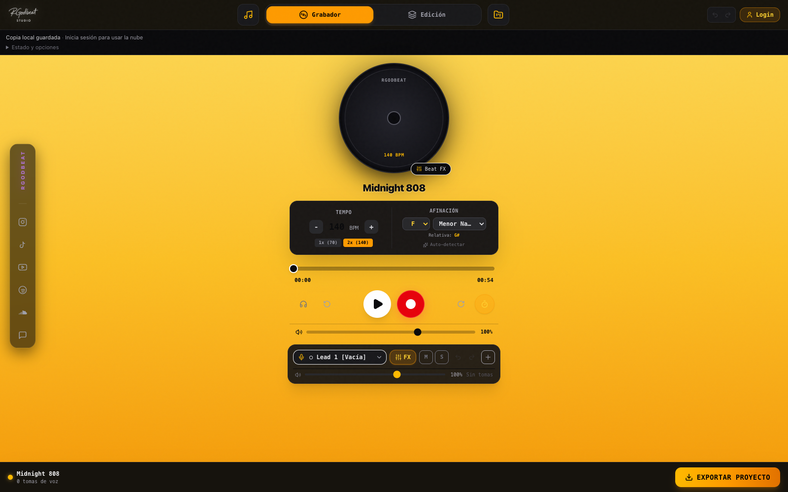
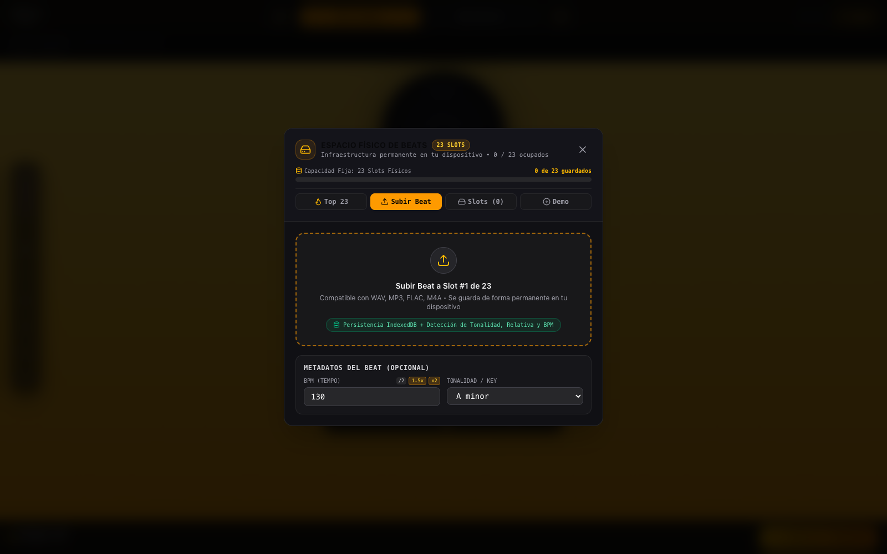
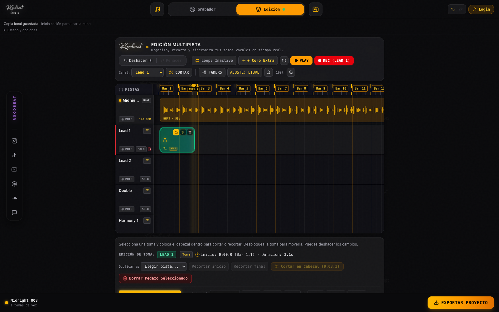
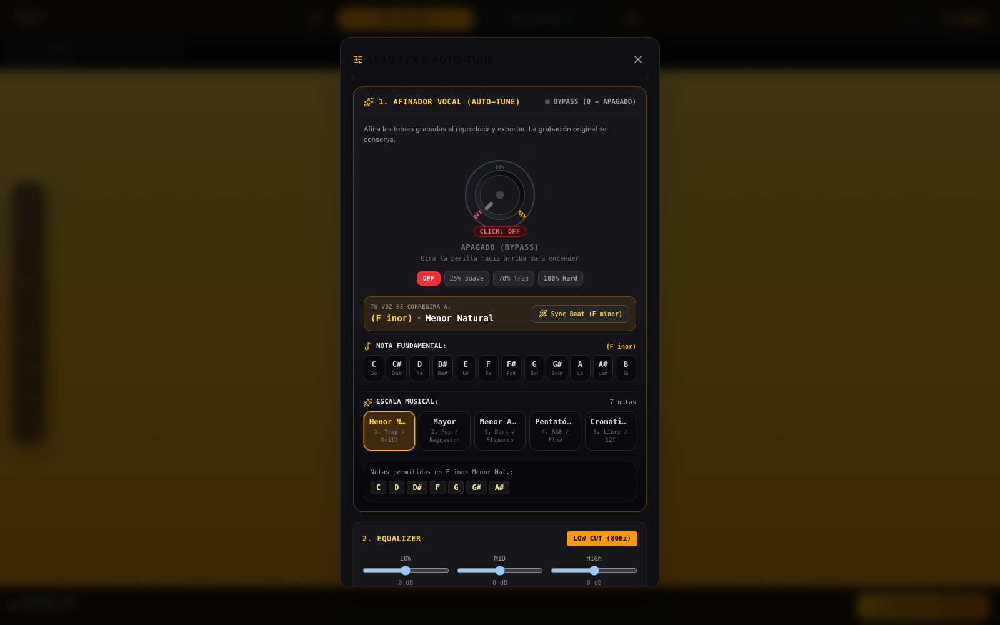

# RGodbeat Studio - Guía de uso y demo con IA

Edición 01 - 10 octubre 2026.

MANUAL + KIT DE PRODUCCIÓN

De la idea
a tu próxima canción.

RGodbeat Studio | Instrucciones reales de la app y estructura para crear un video demo profesional con IA.

---

## Página 01: De la ideaa tu próxima canción.

Interfaz real de la versión local. Las capturas de esta guía usan el modo demo.

**Dos usos, un documento.** Aprende el flujo de trabajo de Studio y utiliza las escenas, la locución y los prompts como base para producir contenido.

| GUÍA DE USO | VIDEO DEMO |
| --- | --- |
| Páginas 02-07Preparación, beat, voz, edición, efectos y archivos. | Páginas 08-14Concepto, storyboard, prompts, montaje y control de calidad. |

Base verificada: código e interfaz del proyecto rgodbeat-v2. El storyboard y la dirección visual son propuestas creativas.

01 / EMPEZAR

Ubícate en Studio

El flujo principal vive en dos vistas: Grabador y Edición.

---

## Página 02: Ubícate en Studio

| CONTROL | QUÉ HACE |
| --- | --- |
| Beat / icono de nota musical | Abre Top 23, Subir Beat, slots guardados y presets. |
| Grabador | Reproductor del beat, selección de voz, REC, conteo y acceso a FX. |
| Edición | Timeline del beat y las voces, cortes, movimiento, mute, solo y mezcla. |
| Opciones de Proyecto | Archivos .rgodbeat, nube, nuevo proyecto e instalación. |
| EXPORTAR PROYECTO | Abre las salidas WAV y stems, según el acceso de tu cuenta. |

Antes de tu primera toma

Abre la sección **Studio (/studio)**. Conecta audífonos, busca un lugar silencioso y haz una prueba corta. Para grabar, permite el acceso al micrófono cuando pulses REC. Los audífonos con cable facilitan revisar el tiempo de la toma.

**Acceso real**
El modo demo permite grabar en Lead 1. Grabar en otros canales y exportar audio requiere un pase activo. Revisa el estado y las condiciones actuales en la app; esta guía no promete acceso gratuito permanente.

Abrirla como app

**iPhone:** en Safari, Compartir > Agregar a Inicio. **Android:** en Chrome, menú > Instalar aplicación o Agregar a inicio, si aparece. La web también tiene una sección Android APK. En Studio puedes abrir la guía del dispositivo desde Opciones de Proyecto > Instalar App Móvil.

Instalar la app no activa por sí solo las funciones de un pase. Desarrollo artístico es un servicio mensual separado del acceso a Studio.

02 / TU INSTRUMENTAL

Carga y prepara el beat

Puedes usar un beat disponible en Top 23, un preset o un archivo propio.

---

## Página 03: Carga y prepara el beat

Selector de beat: pestaña Subir Beat. Usa archivos cuyo audio pueda decodificar tu navegador.

01  **Abre el selector de beat**

Toca el icono de nota musical de la barra superior. En Top 23, elige una pista con audio disponible; en Subir Beat, selecciona tu instrumental.

02  **Revisa BPM y tonalidad**

La app analiza el tempo y la tonalidad del archivo importado. Escucha el resultado y corrige los valores manualmente si no coinciden con tu beat; la detección es una estimación.

03  **Reproduce una prueba**

Pulsa Play y comprueba que escuchas el beat. La reproducción por sí sola no requiere grabar una toma ni activar el micrófono.

**23 slots de beats**
El almacenamiento local admite hasta 23 beats importados. Son slots de instrumentales, no 23 proyectos en la nube. Si están llenos, elimina un beat que ya no necesites. WAV y MP3 son buenas primeras opciones; otros formatos dependen del navegador.

03 / GRABAR

Construye tu primera voz

Empieza con una toma breve; después añade capas si tu pase permite grabación multipista.

---

## Página 04: Construye tu primera voz

01  **Selecciona el canal**

En Grabador elige Lead 1 para la voz principal. Los canales iniciales son Lead 1, Lead 2, Double, Harmony 1, Harmony 2 y Adlibs. Hay hasta dos pistas de apoyo adicionales; su grabación también depende del acceso.

02  **Elige dónde comienza la toma**

Ubica el cabezal antes de la frase. Si necesitas entrada, activa el icono de conteo: la app ofrece un compás previo. En Loop puedes elegir 4, 8, 16 compases o el beat completo.

03  **Pulsa REC y permite el micrófono**

Graba la frase escuchando el beat por audífonos. Observa el medidor; si aparece saturación, baja el nivel en tu micrófono/interfaz o aléjate un poco antes de repetir.

04  **Detén y escucha**

Pulsa STOP. Reproduce la toma y revisa pronunciación, ruido y tiempo. Play escucha el proyecto sin iniciar una nueva grabación.

05  **Haz una segunda pasada con intención**

Prueba una voz de apoyo, una armonía o adlibs. Antes de regrabar sobre material existente, guarda una copia: el punch-in modifica el tramo que estás sustituyendo.

**Si hay retraso**
La app ofrece una compensación fija para Bluetooth; no calibra automáticamente cualquier audífono. Compara una toma corta y ajusta su posición en Edición si lo necesitas. Para el demo, usa audífonos con cable y audio limpio.

**Ejercicio:** graba una frase de 5-10 segundos, detén, escucha y conserva solo la toma que comunique mejor la idea.

04 / EDICIÓN

Ordena las tomas

La vista Edición permite trabajar sobre los clips grabados, sin perder de vista el beat.

---

## Página 05: Ordena las tomas

Timeline real con una toma de muestra. El audio de esta captura es un tono sintético de prueba.

01  **Selecciona y ubica el cabezal**

Toca un clip y pausa la reproducción. Coloca el cabezal dentro de la toma para elegir el punto de corte. Usa zoom si necesitas más precisión.

02  **Corta, recorta o mueve**

Usa Cortar / Dividir para separar una frase. Recortar inicio o final elimina el audio del lado correspondiente del cabezal. Para mover una toma, desactiva su Seguro (Hold); después arrástrala o utiliza los ajustes finos.

03  **Comprueba el conjunto**

Mute silencia una pista y Solo permite escucharla aislada. Ajusta volumen y paneo, y vuelve a escuchar con el beat. Deshacer / Rehacer permite revisar cambios de edición.

**Una acción por toma**
Verifica el clip seleccionado antes de borrar o mover. Elimina solo el fragmento que quieres corregir. Para registrar estas acciones en el video, captura cada clic de forma legible y deja ver su resultado.

05 / SONIDO

Ajusta la voz con FX

La app incluye afinación, ecualización, compresión, saturación, delay y reverb por canal.

---

## Página 06: Ajusta la voz con FX

Panel real de FX vocales. Los controles inferiores pueden requerir desplazamiento dentro del panel.

| CONTROL | CÓMO EMPEZAR |
| --- | --- |
| Afinador vocal | Selecciona nota raíz y escala correctas. Sube el control desde OFF; compara con bypass. No prometas una voz perfecta con un clic. |
| EQ / Compresión | Usa el filtro de graves y ajustes suaves para claridad. Controla la dinámica sin borrar la expresión de la voz. |
| Saturación | Añade carácter con moderación. Comprueba que las consonantes siguen claras. |
| Delay / Reverb | Ajusta mezcla y tipo. Mantén la voz principal al frente y deja los efectos acompañarla. |

**Cómo demostrarlo**
Usa exactamente la misma toma en el antes y el después. Iguala el volumen percibido. Presenta el cambio como una decisión de sonido, sin anunciar afinación instantánea en vivo ni mastering profesional garantizado.

06 / CONSERVAR Y ENTREGAR

Guarda antes de exportar

Un archivo de proyecto sirve para volver a editar. Un WAV sirve para escuchar o enviar audio.

---

## Página 07: Guarda antes de exportar

| SALIDA | CONTENIDO Y USO |
| --- | --- |
| Archivo .rgodbeat | Opciones de Proyecto > Descargar archivo (.rgodbeat). Conserva el proyecto para reabrirlo con Abrir archivo (.rgodbeat). Verifica la descarga. |
| Nube | Inicia sesión. Guardar en la Nube permite nombrar el proyecto y elegir entre 2 espacios. Reemplazar otro proyecto requiere confirmación. Espera el mensaje de guardado. |
| Master Mezclado Completo | Mezcla en WAV de 24 bits. Requiere pase activo. La frecuencia de muestreo se indica en el panel; no es siempre 48 kHz. |
| Stems RAW / Dry | Voces separadas sin los FX del canal, para continuar una mezcla externa. El exportador indica 32-bit float. |
| Stems Wet / Beat WAV | Voces con FX o instrumental por separado. Descarga la salida que corresponda a tu entrega. |

Rutina de cierre

**1.** Escucha el inicio y el final. **2.** Descarga tu .rgodbeat. **3.** Con el acceso requerido, exporta WAV/stems y revisa los archivos. **4.** Si usas la nube, comprueba el espacio y la confirmación.

**Respaldo y publicación**
La memoria local del navegador puede borrarse; mantén una copia descargada. El panel también contempla publicación en YouTube si la integración está disponible y conectada, con datos y derechos confirmados. Ese flujo no se verificó mediante una publicación real y queda fuera del demo principal.

Usar un preview o exportar una maqueta no sustituye la licencia del beat ni los permisos de publicación.

Si algo no responde

**Micrófono:** revisa el permiso del sitio y la entrada seleccionada en tu sistema. **Audio:** pulsa Play, comprueba volumen y salida. **Nube:** revisa sesión y conexión; conserva tu copia local y descarga el .rgodbeat antes de empezar otro proyecto.

PRODUCCIÓN / DIRECCIÓN

Un demo que se entienda

Concepto propuesto: “De la idea a tu próxima canción”. Duración objetivo: 60 segundos.

---

## Página 08: Un demo que se entienda

| DECISIÓN | PROPUESTA DE PRODUCCIÓN |
| --- | --- |
| Objetivo | Mostrar un recorrido creíble: cargar beat > grabar voz > editar > ajustar FX > guardar/exportar. |
| Público | Artistas independientes que quieren desarrollar una canción sobre un instrumental. |
| Formato principal | 16:9, 1920 x 1080, 30 fps. Versión vertical independiente en 1080 x 1920; no recortes toda la interfaz a ciegas. |
| Estilo | Negro y grafito, acentos ámbar, detalles morados. Cámara estable, luz cálida, transiciones breves y tipografía limpia. |
| Material principal | Captura real de Studio. IA para el ambiente, micrófono o planos de cierre. Logo y textos exactos añadidos en edición. |

Prepara estos materiales

**Audio:** un instrumental autorizado y una frase vocal propia. **Producto:** grabaciones de las dos vistas, carga del beat, FX y exportación. **Marca:** logo original. **Montaje:** locución separada, subtítulos y cierre con la ruta de Studio.

**Capturas incluidas**
Los PNG del kit muestran la interfaz local real en modo demo; la toma visible usa un tono sintético de prueba. Sirven para preparar la producción. Para el anuncio final, graba una voz musical real y usa un pase activo para mostrar las funciones de pago en funcionamiento.

Tiempo en pantalla: aproximadamente 47 segundos de producto y 13 de apertura/cierre. La interfaz es la protagonista.

STORYBOARD / 00:00-00:26

Presenta y demuestra

Los tiempos son objetivos de montaje. Genera los planos de IA por separado y recórtalos al editar.

---

## Página 09: Presenta y demuestra

00:00-00:05  /  La idea

**Plano y acción.** Plano corto de micrófono y audífonos, luz ámbar lateral y fondo grafito. Acercamiento suave. IA o rodaje real; ningún botón inventado.

**Locución.** “Esa idea que tienes merece escucharse.”

**Texto en pantalla.** TU PRÓXIMA CANCIÓN EMPIEZA AQUÍ

00:05-00:11  /  El producto

**Plano y acción.** Corte a una captura real de Grabador. Entra el logo original como gráfico. Enmarca el reproductor y los controles, sin ocultarlos.

**Locución.** “RGodbeat Studio reúne tu beat y tu voz en un mismo espacio.”

**Texto en pantalla.** RGODBEAT STUDIO

00:11-00:18  /  El beat

**Plano y acción.** Abre el icono de nota musical. Muestra Subir Beat y selecciona el archivo autorizado. Corte limpio al beat ya cargado; conserva el título y BPM reales.

**Locución.** “Elige una pista del catálogo o carga tu propio instrumental.”

**Texto en pantalla.** ELIGE TU BEAT

00:18-00:26  /  La toma

**Plano y acción.** Selecciona Lead 1, activa conteo y pulsa REC. Muestra brevemente el medidor y el resultado tras STOP. La voz escuchada corresponde a esa toma.

**Locución.** “Selecciona tu canal, activa el conteo y graba tu primera toma.”

**Texto en pantalla.** GRABA TU VOZ

STORYBOARD / 00:26-01:00

Haz visible el resultado

Mantén acciones simples y lectura clara. El espectador debe entender qué cambió.

---

## Página 10: Haz visible el resultado

00:26-00:34  /  La edición

**Plano y acción.** Abre Edición. En una captura real, selecciona una toma, coloca el cabezal y divide. Acerca el plano al resultado; si la mueves, muestra que desbloqueaste Hold.

**Locución.** “En Edición, corta, acomoda y organiza cada parte.”

**Texto en pantalla.** DALE FORMA A TU TOMA

00:34-00:43  /  El sonido

**Plano y acción.** Abre FX de la misma voz. Enseña tonalidad correcta y un ajuste pequeño de reverb. Alterna 2 segundos de voz seca y 2 segundos con FX al mismo volumen.

**Locución.** “Ajusta afinación, ecualización, compresión, delay y reverb. Escucha la diferencia.”

**Texto en pantalla.** TU VOZ / TU SONIDO

00:43-00:52  /  La entrega

**Plano y acción.** Captura Descargar archivo (.rgodbeat). Con un pase activo real, abre EXPORTAR PROYECTO y muestra WAV y stems. Usa una descarga verdadera; no fabriques el mensaje de éxito.

**Locución.** “Guarda tu proyecto. Con un pase activo, exporta tu mezcla WAV y tus voces por separado.”

**Texto en pantalla.** GUARDA + EXPORTA
Exportación de audio con pase activo

00:52-01:00  /  La invitación

**Plano y acción.** Plano de ambiente o cierre limpio con el logo original añadido en montaje. Deja la ruta de Studio al menos los últimos 3 segundos, sin animación que dificulte leerla.

**Locución.** “De la idea a tu próxima canción. Empieza en RGodbeat Studio.”

**Texto en pantalla.** EMPIEZA EN STUDIO / rgodbeat.com/studio

PROMPTS / PLANOS DE AMBIENTE

Genera el ambiente con IA

Prompts en inglés para copiar; la locución y los rótulos finales se mantienen en español.

---

## Página 11: Genera el ambiente con IA

A / Apertura de micrófono

**PROMPT PARA COPIAR**
Cinematic close-up of a real studio microphone and wired headphones on a graphite desk, warm amber side light, subtle violet background glow, intimate independent music studio at night. Slow controlled camera push-in, shallow depth of field, realistic materials, premium music product film. Leave clean dark negative space on the left for a title added later. No text, no logos, no interface, no dialogue, no music.

B / Plano de manos opcional

**PROMPT PARA COPIAR**
Close-up of an adult music artist placing wired headphones beside a microphone in the same graphite studio, warm amber light from camera right, subtle violet background. Natural hand movement, physically correct fingers, calm confident mood, stable camera, realistic commercial cinematography. Do not show readable device screens. No text, no logos, no dialogue, no generated music.

C / Cierre de marca

**PROMPT PARA COPIAR**
Minimal cinematic graphite studio background with a soft warm amber light reflection and a subtle violet edge light. Slow almost imperceptible camera drift, elegant restrained atmosphere, clean center and lower area reserved for a logo and call to action added in editing. No text, no logos, no interface, no people, no dialogue, no music.

**Continuidad:** conserva dirección de luz, escritorio y paleta entre planos. Usa la misma imagen de referencia si tu herramienta lo permite. Genera variantes y selecciona la más natural; la duración final se fija en el montaje.

IA / ENSAMBLAJE

Cómo llevarlo a Flow o similar

Flujo adaptable. Verifica qué controles de video y referencias ofrece tu modelo antes de generar.

---

## Página 12: Cómo llevarlo a Flow o similar

01  **Crea el proyecto y define el formato**

En Google Flow abre o crea un proyecto, selecciona Video y revisa relación de aspecto y duración. Genera la apertura y el cierre como clips independientes. [1]

02  **Añade referencias coherentes**

Cuando estén disponibles, usa Ingredients para mantener objetos/estilo o Frames para definir el inicio/final. Añade un prompt que describa la acción y complemente la imagen. [1]

03  **Graba la app fuera del generador**

Registra las acciones de las escenas 2-7 en Studio. Importa esas grabaciones al editor de video que uses; no pidas al modelo recrear menús, textos o resultados de la aplicación.

04  **Monta, mezcla y subtitula**

Ordena los clips con los tiempos del storyboard. Añade la voz, el instrumental, los rótulos exactos, el logo y los subtítulos del kit. La disponibilidad de funciones de Flow puede variar; el montaje final puede hacerse en otro editor.

**Prompt maestro para una IA de guion o edición**
Usa esta guía como fuente de verdad para producir un demo de RGodbeat Studio de 60 segundos en español, 16:9. Respeta los ocho bloques del storyboard y la locución. Utiliza mis capturas reales para toda interacción con la app; genera solo los planos de ambiente. Mantén negro/grafito, luz ámbar y detalles morados. Añade el logo original y los rótulos en edición. Indica que exportar audio requiere un pase activo. No inventes controles, precios, resultados, compatibilidad ni una publicación exitosa. Entrega lista de clips, orden de montaje y tareas pendientes con los materiales que falten.

[1] Google Flow Help, “Create videos in Google Flow”. Fuente oficial consultada el 10/10/2026. Enlace completo en la página 14.

AUDIO / ADAPTACIONES

Locución lista para producir

Voz cercana y segura, español latino neutro. Ritmo natural, sin estilo de anuncio exagerado.

---

## Página 13: Locución lista para producir

**00:00-00:05**  Esa idea que tienes merece escucharse.

**00:05-00:11**  RGodbeat Studio reúne tu beat y tu voz en un mismo espacio.

**00:11-00:18**  Elige una pista del catálogo o carga tu propio instrumental.

**00:18-00:26**  Selecciona tu canal, activa el conteo y graba tu primera toma.

**00:26-00:34**  En Edición, corta, acomoda y organiza cada parte.

**00:34-00:43**  Ajusta afinación, ecualización, compresión, delay y reverb. Escucha la diferencia.

**00:43-00:52**  Guarda tu proyecto. Con un pase activo, exporta tu mezcla WAV y tus voces por separado.

**00:52-01:00**  De la idea a tu próxima canción. Empieza en RGodbeat Studio.

Versión vertical de 15 segundos

**0-3 s:** “Tu beat. Tu voz.” + micrófono. **3-7 s:** captura de REC. **7-11 s:** edición y FX, una acción por plano. **11-15 s:** logo + “Empieza en RGodbeat Studio” + ruta. Este recorte puede centrarse en crear; si muestra exportación, conserva la condición de pase activo.

Cuatro piezas educativas

1. Cargar un instrumental y revisar su BPM. 2. Grabar una primera voz con conteo. 3. Cortar una toma y usar Hold. 4. Diferencia entre proyecto .rgodbeat, master WAV y stems. Cada pieza demuestra una sola acción real.

**Sonido del demo**
Durante el antes/después de FX deja respirar la voz musical. Baja la locución y la música de fondo para que el cambio sea audible. El SRT incluido es una base de tiempos: ajústalo a la interpretación final y revisa la pronunciación de RGodbeat.

ENTREGA / VERIFICACIÓN

Antes de publicar

Una revisión final mantiene coherencia entre lo que enseñas y lo que la app permite hacer.

---

## Página 14: Antes de publicar

| REVISIÓN | CRITERIO DE ENTREGA |
| --- | --- |
| Producto | Botones y pantallas reales, nombres correctos, pase activo para demostrar exportación/multipista. No señales una descarga como exitosa sin comprobar el archivo. |
| Imagen | Cursor visible cuando aporte claridad, zoom moderado, textos nítidos, logo original. En vertical, usa encuadres específicos para cada control. |
| Audio | Voz inteligible, beat autorizado y comparación de FX al mismo volumen. Sin saturación, saltos bruscos o tomas sintéticas en el anuncio final. |
| Montaje | Duración cercana a 60 s, ritmo claro, subtítulos sincronizados y CTA legible durante al menos 3 s. Revisa la ruta pública antes de lanzar la campaña. |

Fuentes y alcance

**Producto:** componentes StudioApp, TopBar, LoadBeatModal, TimelineWorkspace, VocalFXModal y ExportModal; módulos de guardado local y nube; API de acceso. Revisados en el repositorio rgodbeat-v2 el 10/10/2026. No se probaron compras, guardados de cuenta ni publicaciones reales para crear esta guía.

**[1] Fuente oficial de Flow:**
support.google.com/flow/answer/16353334
Respalda la creación por prompts y el uso de Ingredients/Frames. Los parámetros de cámara, la duración de 60 segundos y el montaje aquí propuestos son dirección creativa para RGodbeat.

**Qué incluye el kit editable**
Guion y prompts en Markdown, subtítulos SRT de referencia, cuatro capturas PNG y el logo original. El PDF es el manual y plan de producción; no contiene un video ya generado. Las capturas de prueba no acreditan acceso premium ni una exportación real.